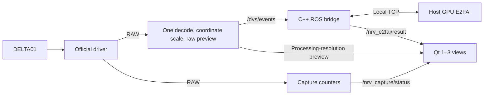

# NRV_Demo

**English** | [简体中文](README.zh-CN.md)

E2FAI reconstruction and optical flow for the NRV DELTA01, using `12fe7f9` as the project baseline. ROS, Qt, and the decoded-event preview run in Docker; E2FAI runs in a separate host GPU process connected to a C++ ROS bridge over local TCP. The former Python centroid algorithm and software filters have been removed.

## Start

Requirements: Linux x86_64, Docker Engine / Compose v2, Conda, an NVIDIA driver compatible with the CUDA 12.1 PyTorch build, and X11/XWayland with `DISPLAY` and `xhost` for the GUI. Stop other programs using the camera first.

For daily use, launch from any directory without activating Conda:

```bash
nrv-demo
```

You can also search for **NRV Demo** in the desktop application menu. From the project itself, use `./start.sh`. Create the model environment only once; the run flow builds the container image automatically when it is absent:

```bash
./scripts/setup_e2fai.sh  # Create the host model environment once
./scripts/build.sh        # Rebuild after container source changes
./scripts/run.sh
```

The host environment uses Python 3.10, PyTorch 2.1.1, NumPy 1.26.4, and OpenCV 4.7.0.72. The launcher defaults to `~/miniconda3/envs/nrv-e2fai/bin/python`; override with `E2FAI_PYTHON`. Supply both matching weights at `checkpoints/e2fai_backbone.ckpt` and `checkpoints/image_residual_epoch043.pt`; setup does not download weights.

## Views and camera controls

The three default views are **Original rendering**, **E2FAI reconstruction**, and **E2FAI optical flow**. Use **Views** to select 1–3 panels. Hiding a panel does not stop the model or alter its input.

Incoming pixmaps no longer determine layout size, so asynchronous image arrival does not resize adjacent panels. The main window remains freely resizable.

**Settings** offers **50 / 100 / 150 / 200 / 250 ms** time windows, **960×720 / 640×480 / 384×288** processing resolutions, incremental/compatibility voxel modes, and a host-queue automatic catch-up switch. The default `fixed_window` mode uses fixed-window normalization, asynchronous microbatches, and a three-voxel pool; `event_span` retains the original full-window path for rollback. Turning catch-up off disables the 800 ms and 1.5 GiB proactive triggers; the 4 GiB/256-batch safety cleanup still deletes the oldest data and keeps running. Click **Apply parameters** to apply edits. Changing any of them while running automatically restarts acquisition and creates a new model session.

**Save profile / Load profile** stores camera settings, time window, processing resolution, and selected views. Loaded processing edits wait for Apply; view selection changes immediately. Profiles without the new `processing` field remain compatible and keep the current window and resolution. The applied profile is saved to `output/last_applied_parameters.json`.

**Stop** ends acquisition and the inference session, clearing recurrent state while retaining loaded weights. **Start** creates a new session and rejects old results. Closing the GUI or pressing Ctrl+C stops the GPU process and releases its port.

## Model and time scale

Defaults are **200 ms half-open windows `[start, end)`, 960×720 processing resolution, all events, and 15-bin voxels**. One U-Net/ConvGRU model and the same two checkpoints support all three resolutions, with a resolution-specific dense-flow interpolation grid.

Resolution takes effect immediately after the RAW packet's first decode. Event coordinates are mapped over the full sensor field of view; `/dvs/events`, voxels, model outputs, floating-point flow, and Original rendering then all use the selected size. Event count, order, polarity, and timestamps are preserved. Lower resolutions reduce voxel, neural-network, result-transfer, and preview-buffer work; they do not reduce camera USB RAW traffic, first-decode work, or event count.

`32FC2` flow is measured in **selected inference-grid pixels per input window**. Divide by the actual window duration in seconds when mean pixel velocity is needed. Preview saturation tracks 200 pixels/second, so the five window choices use 10 / 20 / 30 / 40 / 50 pixels respectively; this affects preview colors only. Backward timestamps, real event gaps exceeding **300 ms**, dimension/connection changes, and detected batch discontinuities clear window and recurrent state.

The default `E2FAI_RESULT_MODE=thread` moves CPU result visualization and TCP transmission to an ordered worker thread so they can overlap subsequent inference. The result queue still holds at most one pending job; catch-up invalidates older generations. Set `E2FAI_RESULT_MODE=inline` to restore serial result handling for comparison or rollback.

The host FIFO has a **1.5 GiB (1536 MiB) proactive trigger, 4 GiB (4096 MiB) hard limit, and 512 MiB cleanup target**. Reaching **256 batches** also trims the oldest whole batches to half the batch limit. Freshness catch-up is **on by default**: a source callback age strictly over **800 ms** triggers cleanup to **400 ms** or less. Disabling automatic catch-up suppresses the 800 ms and 1.5 GiB triggers, while the 4 GiB and 256-batch safety cleanup always retains the newest suffix and keeps the session running.

`E2FAI_FRESHNESS=false ./scripts/run.sh` disables the waiting-time policy; capacity recovery remains active. `E2FAI_QUEUE_BATCHES` overrides the default 256-batch guard. The C++ sender FIFO keeps its 32-batch / 256 MiB bounds and drops unsent old batches on overflow, preserving any packet already being transmitted. Catch-up clears partial windows and ConvGRU state, invalidates older results, and displays “正在追赶” in the GUI. See [catch-up changes and short checks](docs/E2FAI自动追赶与短测.md). Earlier recorded camera tests do not validate this new policy's live performance.

The decoder correction addresses the approximately 4,295-second timestamp jump while preserving event order and sensor counter relationships; it does not hide the anomaly with packet-header interpolation. Ages computed from mapped timestamps are not calibrated physical end-to-end latency.

## Commands

```bash
# Short camera check; GUI remains after acquisition ends
DURATION=20 ./scripts/run.sh

# Headless acquisition and inference
SHOW_GUI=false DURATION=20 ./scripts/run.sh

# Optional periodic performance records, disabled by default
PERF_ENABLED=true DURATION=20 ./scripts/run.sh

# Disable proactive catch-up; 4 GiB/256-batch safety cleanup remains active
CATCHUP_ENABLED=false SHOW_GUI=false ./scripts/run.sh

# Official rendering without the host model
E2FAI_ENABLED=false ./scripts/run.sh

# RAW reception only
DECODE_EVENTS=false SHOW_GUI=false DURATION=20 ./scripts/run.sh

# Select a camera, or override processing for a headless launch
CAMERA_INDEX=1 ./scripts/run.sh
WINDOW_MS=150 PROCESSING_WIDTH=640 PROCESSING_HEIGHT=480 ./scripts/run.sh

# Roll back the result thread, retaining the 200 ms window
E2FAI_RESULT_MODE=inline ./scripts/run.sh

# Roll back to original full-window voxelization; fixed_window is the default
E2FAI_VOXEL_MODE=event_span ./start.sh
```

## Data path and outputs



Driver, decoder, and renderer share the nodelet manager. Capture counters, the C++ bridge, and Qt are separate processes. TCP defaults to `127.0.0.1:8765`. Qt caches the latest images and does not wait for inference.

| Topic | Content |
| --- | --- |
| `/delta_driver/events` | `event_camera_msgs/EventPacket`: RAW payload and metadata |
| `/dvs/events` | `dvs_msgs/EventArray`: ordered `(x, y, ts, polarity)` |
| `/delta_renderer/image` | Decoded-event preview at the selected processing resolution |
| `/nrv_e2fai/result` | Session/window/source-batch metadata, `mono8` reconstruction, `rgb8` flow preview, `32FC2` flow |
| `/nrv_e2fai/status` | Bridge connection/catch-up/pause state, processing generation and counters |
| `/nrv_capture/status` | RAW packet count, byte rate, sequence-discontinuity count |

Results are saved under `output/run_*/`. `summary.json` checks RAW reception and sequence continuity only; `raw_sequence_gaps` counts discontinuity incidents. Model and bridge records are `e2fai_session_*.json` and `sessions/<session>/bridge_summary.json`. `integration_summary.json` checks RAW capture, model results, session errors, and ROS batch discontinuities; valid time resets are recorded without automatically failing the run. PASS does not establish real-time performance. `PERF_ENABLED=true` additionally writes periodic `performance_*.jsonl`. GUI timing ends at `setPixmap`, not physical monitor presentation.

Intentional catch-up losses have separate `catchup_*` counters and mark the integration summary `DEGRADED` without becoming session errors or RAW sequence gaps. The result message adds `processing_generation`; NEF1 keeps its framing/event bytes and adds status packets plus generation metadata. Rebuild the ROS image and any external result subscribers together.

Current results are in the [E2FAI 150 ms, 30-second load test](docs/E2FAI150ms窗口30秒负载测试.md), with the [200 ms, 30-second load test](docs/E2FAI200ms窗口30秒负载测试.md) retained for reference. The [250 ms and result-thread measurements](docs/E2FAI250ms与结果线程实测.md), [earlier fixes and short camera checks](docs/E2FAI修复与真机短测.md), and the [migration report](docs/移植后性能测试与瓶颈分析.md) remain as historical records; results using earlier window durations or bridge implementations do not represent the current build.

[examples/raw_receiver.py](examples/raw_receiver.py) remains an independent RAW receiver example and does not run in the demo pipeline. `group_aer` is encoded data with cross-packet state, not a complete `.dvs` file; retain encoding, sequence, time base, dimensions, and other metadata when forwarding it.

The image uses Ubuntu 20.04, ROS Noetic, and the NRV SDK/driver packages. Rebuild with `./scripts/build.sh` after changing container source. USB is exposed through `/dev/bus/usb`; the launcher temporarily grants container X11 access and revokes it at exit. Example code is [MIT licensed](LICENSE); vendor dependencies and `dvs_msgs` retain their own licenses.
