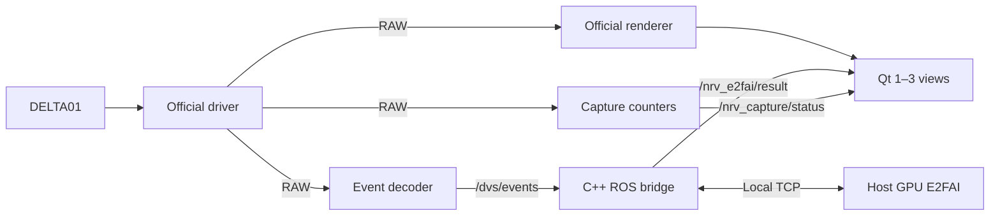

# NRV_Demo

**English** | [简体中文](README.zh-CN.md)

E2FAI reconstruction and optical flow for the NRV DELTA01, using `12fe7f9` as the project baseline. ROS, Qt, and the official event renderer run in Docker; E2FAI runs in a separate host GPU process connected to a C++ ROS bridge over local TCP. The former Python centroid algorithm and software filters have been removed.

## Start

Requirements: Linux x86_64, Docker Engine / Compose v2, Conda, an NVIDIA driver compatible with the CUDA 12.1 PyTorch build, and X11/XWayland with `DISPLAY` and `xhost` for the GUI. Stop other programs using the camera first.

```bash
./scripts/setup_e2fai.sh  # Create the host model environment once
./scripts/build.sh      # Build initially and after container source changes
./scripts/run.sh
```

The host environment uses Python 3.10, PyTorch 2.1.1, NumPy 1.26.4, and OpenCV 4.7.0.72. The launcher defaults to `~/miniconda3/envs/nrv-e2fai/bin/python`; override with `E2FAI_PYTHON`. Supply both matching weights at `checkpoints/e2fai_backbone.ckpt` and `checkpoints/image_residual_epoch043.pt`; setup does not download weights.

## Views and camera controls

The three default views are **Original rendering**, **E2FAI reconstruction**, and **E2FAI optical flow**. Use **Views** to select 1–3 panels. One fills the area; two or three are arranged side by side in a single row. Hiding a panel does not stop the model or alter its input.

Incoming pixmaps no longer determine layout size, so asynchronous image arrival does not resize adjacent panels. The main window remains freely resizable.

**Settings** retains the hardware ON/OFF controls. Click **Apply parameters** to apply edits; hardware changes restart acquisition and create a new model session. ON/OFF are the low six bits of registers `0x0167` / `0x0168`, shown as decimal codes 0–63, not calibrated sensitivity. Other bits and sensor settings are preserved. Hardware settings affect both the original rendering and model input.

**Save profile / Load profile** stores camera settings and selected views. Loaded camera edits wait for Apply; view selection changes immediately. Old `filters` fields are ignored and the removed `algorithm` view is discarded. If no views remain, all three are selected. The applied profile is saved to `output/last_applied_parameters.json`.

**Stop** ends acquisition and the inference session, clearing recurrent state while retaining loaded weights. **Start** creates a new session and rejects old results. Closing the GUI or pressing Ctrl+C stops the GPU process and releases its port.

## Model and time scale

Defaults are **250 ms half-open windows `[start, end)`, native 960×720 resolution, all events, and 15-bin voxels**. The complete U-Net, flow pooling/interpolation, ConvGRU image residual, and both checkpoints are retained. The model reads `/dvs/events` directly; input events are not sorted, sampled, or replaced with interpolated timestamps.

`32FC2` flow is measured in **inference-grid pixels per input window**, currently pixels per 250 ms. Divide by the actual window duration in seconds when mean pixel velocity is needed. The color preview defaults to a saturation scale of **50 pixels per 250 ms**, equivalent to 200 pixels/second; this affects preview colors only. Backward timestamps, real event gaps exceeding **300 ms**, dimension/connection changes, and detected batch discontinuities clear window and recurrent state. Queue overload now skips old data, resets state and resumes automatically; the camera connection and original display continue.

The default `E2FAI_RESULT_MODE=thread` moves CPU result visualization and TCP transmission to an ordered worker thread so they can overlap subsequent inference. The result queue still holds at most one pending job; catch-up invalidates older generations. Set `E2FAI_RESULT_MODE=inline` to restore serial result handling for comparison or rollback.

The host FIFO has a **1 GiB (1024 MiB) catch-up trigger, 2 GiB (2048 MiB) hard limit, and 512 MiB cleanup target**. Reaching **256 batches** also trims the oldest whole batches to half the batch limit. Freshness control is **on by default**: a source callback age over **500 ms** triggers cleanup to **250 ms** or less. Either capacity or waiting time can trigger catch-up before insertion; retained events stay in order with unchanged timestamps. Completed windows waiting for inference are checked separately from their input-completion time. Normal 250 ms window collection is not counted as backlog. These limits constrain waiting, not camera-to-screen latency; 2 GiB limits only the host event FIFO, not total process memory.

`E2FAI_FRESHNESS=false ./scripts/run.sh` disables the waiting-time policy; capacity recovery remains active. `E2FAI_QUEUE_BATCHES` overrides the default 256-batch guard. The C++ sender FIFO keeps its 32-batch / 256 MiB bounds and drops unsent old batches on overflow, preserving any packet already being transmitted. Catch-up clears partial windows and ConvGRU state, invalidates older results, and displays “正在追赶” in the GUI. See [catch-up changes and short checks](docs/E2FAI自动追赶与短测.md). Earlier recorded camera tests do not validate this new policy's live performance.

The decoder correction addresses the approximately 4,295-second timestamp jump while preserving event order and sensor counter relationships; it does not hide the anomaly with packet-header interpolation. Ages computed from mapped timestamps are not calibrated physical end-to-end latency.

## Commands

```bash
# Short camera check; GUI remains after acquisition ends
DURATION=20 ./scripts/run.sh

# Headless acquisition and inference
SHOW_GUI=false DURATION=20 ./scripts/run.sh

# Optional periodic performance records, disabled by default
PERF_ENABLED=true DURATION=20 ./scripts/run.sh

# Official rendering without the host model
E2FAI_ENABLED=false ./scripts/run.sh

# RAW reception only
DECODE_EVENTS=false SHOW_GUI=false DURATION=20 ./scripts/run.sh

# Select a camera or override the window duration
CAMERA_INDEX=1 ./scripts/run.sh
WINDOW_MS=250 ./scripts/run.sh

# Roll back the result thread, retaining the 250 ms window
E2FAI_RESULT_MODE=inline ./scripts/run.sh
```

## Data path and outputs



Driver, decoder, and renderer share the nodelet manager. Capture counters, the C++ bridge, and Qt are separate processes. TCP defaults to `127.0.0.1:8765`. Qt caches the latest images and does not wait for inference.

| Topic | Content |
| --- | --- |
| `/delta_driver/events` | `event_camera_msgs/EventPacket`: RAW payload and metadata |
| `/dvs/events` | `dvs_msgs/EventArray`: ordered `(x, y, ts, polarity)` |
| `/delta_renderer/image` | Official event rendering |
| `/nrv_e2fai/result` | Session/window/source-batch metadata, `mono8` reconstruction, `rgb8` flow preview, `32FC2` flow |
| `/nrv_e2fai/status` | Bridge connection/catch-up/pause state, processing generation and counters |
| `/nrv_capture/status` | RAW packet count, byte rate, sequence-discontinuity count |

Results are saved under `output/run_*/`. `summary.json` checks RAW reception and sequence continuity only; `raw_sequence_gaps` counts discontinuity incidents. Model and bridge records are `e2fai_session_*.json` and `sessions/<session>/bridge_summary.json`. `integration_summary.json` checks RAW capture, model results, session errors, and ROS batch discontinuities; valid time resets are recorded without automatically failing the run. PASS does not establish real-time performance. `PERF_ENABLED=true` additionally writes periodic `performance_*.jsonl`. GUI timing ends at `setPixmap`, not physical monitor presentation.

Intentional catch-up losses have separate `catchup_*` counters and mark the integration summary `DEGRADED` without becoming session errors or RAW sequence gaps. The result message adds `processing_generation`; NEF1 keeps its framing/event bytes and adds status packets plus generation metadata. Rebuild the ROS image and any external result subscribers together.

Current results are in [E2FAI 250 ms and result-thread measurements](docs/E2FAI250ms与结果线程实测.md), delivered as Markdown. [Earlier fixes and short camera checks](docs/E2FAI修复与真机短测.md) and the [migration report](docs/移植后性能测试与瓶颈分析.md) remain as historical records; results using earlier window durations or bridge implementations do not represent the current build.

[examples/raw_receiver.py](examples/raw_receiver.py) remains an independent RAW receiver example and does not run in the demo pipeline. `group_aer` is encoded data with cross-packet state, not a complete `.dvs` file; retain encoding, sequence, time base, dimensions, and other metadata when forwarding it.

The image uses Ubuntu 20.04, ROS Noetic, and the NRV SDK/driver packages. Rebuild with `./scripts/build.sh` after changing container source. USB is exposed through `/dev/bus/usb`; the launcher temporarily grants container X11 access and revokes it at exit. Example code is [MIT licensed](LICENSE); vendor dependencies and `dvs_msgs` retain their own licenses.
