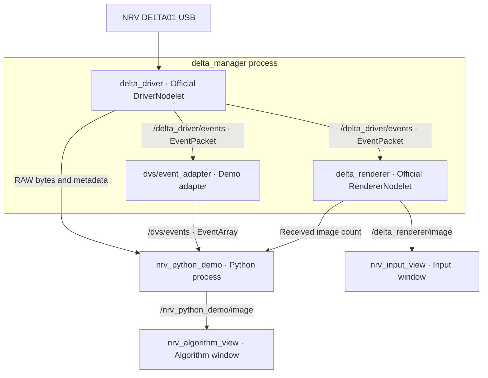

# NRV_Demo

**English** | [简体中文](README.zh-CN.md)

A standalone **Docker + ROS1 Noetic + Python 3** demo for the NRV DELTA01: receive RAW event streams while viewing both the official rendered image and Python algorithm output.

This repository contains only the two ROS packages, container configuration, and scripts needed for the demo. The image uses the public official `ros:noetic-ros-core-focal` base (Ubuntu 20.04). The SDK runtime, official driver, and codecs are installed from the NRV package repository.

## Quick start

Host requirements: Linux x86_64, Docker Engine, Docker Compose v2, and Python 3. The two image windows also require X11 or XWayland, `DISPLAY`, and `xhost` (the `x11-xserver-utils` package on Ubuntu). ROS and algorithm dependencies run inside the container.

Connect the NRV DELTA01 and stop any Viewer, jAER, or other capture application using the same camera.

```bash
git clone https://github.com/lixiang-moss/NRV_Demo.git
cd NRV_Demo
./scripts/run.sh
```

The first run automatically builds `nrv-demo:noetic`. To build it separately, run `./scripts/build.sh`.

By default, two `rqt_image_view` windows open. Identify them using the topic selector in each window:

- **Input view** `/delta_renderer/image`: the official renderer's event image.
- **Algorithm view** `/nrv_python_demo/image`: a Python-generated event image with a yellow activity-centroid cross, event count, and coordinates.

Place the windows side by side and move your hand or an object in front of the camera. Green pixels represent ON events; blue pixels represent OFF events. The algorithm averages all event coordinates in the current display window to demonstrate integration. It is not an object detector: background activity and camera motion also affect the centroid. No centroid is drawn when the window contains no events.

Press **Ctrl+C** to stop. Results are saved to `output/run_*/summary.json`, with the final algorithm image in `algorithm_last.png` in the same directory.

## Common commands

```bash
# Show both views for 20 seconds, then exit automatically
DURATION=20 ./scripts/run.sh

# Headless: keep RAW, decoding, and both image topics; disable viewer windows
SHOW_GUI=false DURATION=20 ./scripts/run.sh

# RAW only: disable decoding, algorithm images, and the official renderer
DECODE_EVENTS=false SHOW_GUI=false DURATION=20 ./scripts/run.sh

# Select a camera by SDK serial number or device index (default: 0)
CAMERA_SERIAL=YOUR_SERIAL ./scripts/run.sh
CAMERA_INDEX=1 ./scripts/run.sh

# Set the target display rate (actual rate depends on event load and Python processing)
./scripts/run.sh image_fps:=15

# Rebuild after changing package source code
./scripts/build.sh
```

## Real-time E2FAI image and flow

`run_e2fai.sh` keeps the NRV ROS driver/decoder in Docker and runs the GPU model
on the host. It displays a synchronized three-panel view: white-background
events, E2FAI plus the recurrent image residual, and the original pooled E2FAI
flow.

The minimal model runtime is bundled in this repository. Checkpoints are kept
locally and ignored by Git. Put them either in the repository root using their
original names (`e2fai_backbone.ckpt`, `epoch_043.pt`) or under `checkpoints/`
as shown in the repository layout. Create the host GPU environment once, then
run the demo:

```bash
conda env create -f environment-e2fai.yml
conda activate nrv-e2fai
./scripts/run_e2fai.sh

# Select another physical GPU; optionally record the displayed stream
GPU=1 RECORD=true ./scripts/run_e2fai.sh

# No display (still saves summary.json and the final frame)
HEADLESS=true DURATION=30 ./scripts/run_e2fai.sh
```

Override the interpreter or weights with `PYTHON`, `IMAGE_CHECKPOINT`, or
`BACKBONE_CHECKPOINT`. Results are written below
`output/e2fai_*`. The default input is a non-overlapping 100 ms, 15-bin,
720×960 voxel; `WINDOW_MS=...` changes the window. DELTA01 events are processed
at their native 960×720 resolution without crop or resize. Flow is measured in
native sensor pixels per window.

This first hardware adapter does not apply camera rectification. Expect domain
shift from DSEC until an NRV calibration and fine-tuning data are available.

USB access uses `/dev/bus/usb` and a USB device cgroup rule. The script temporarily grants the root container X11 access and revokes it on exit. ROS uses host networking with localhost defaults; stop other ROS demos using the same node names before starting.

## Data flow and nodes



`roslaunch` starts `roscore` when needed. The driver, adapter, and renderer share a nodelet manager; Python and the two viewers run as separate processes.

| Topic | ROS message | Content |
| --- | --- | --- |
| `/delta_driver/events` | `event_camera_msgs/EventPacket` | Official RAW encoded payload, sequence number, encoding, timing metadata, width, and height |
| `/dvs/events` | `dvs_msgs/EventArray` | Decoded `(x, y, ts, polarity)` event arrays |
| `/dvs/camera_info` | `sensor_msgs/CameraInfo` | Camera information; no calibration parameters are supplied, and the centroid algorithm does not require them |
| `/delta_renderer/image` | `sensor_msgs/Image` | Official rendered image |
| `/nrv_python_demo/image` | `sensor_msgs/Image`, `bgr8` | Python algorithm image |

The two image paths accumulate events independently, so their display windows are not strictly synchronized. The default target image rate is 10 Hz; the RAW subscription does not subsample events based on the display rate.

## Receiving RAW data in your algorithm

With the demo running, open another terminal in the repository directory:

```bash
docker compose run --rm nrv-demo python3 /examples/raw_receiver.py
```

[examples/raw_receiver.py](examples/raw_receiver.py) is a minimal Python receiver you can modify directly. Its core interface is:

```python
from event_camera_msgs.msg import EventPacket

def on_raw(msg):
    payload = memoryview(msg.events)
    # Call your algorithm here with the payload and required metadata.

subscriber = rospy.Subscriber("/delta_driver/events", EventPacket, on_raw,
                              queue_size=100, buff_size=16 * 1024 * 1024)
```

The `examples/` directory is mounted read-only inside the container. Edit the receiver on the host and rerun it; no image rebuild is needed. The container entrypoint already sources ROS and the workspace. For an interactive shell, run `docker compose run --rm nrv-demo bash`.

**What RAW means here:** `msg.events` is a `uint8[]` encoded payload, received as bytes in rospy. The current driver uses `group_aer`. This is neither an array of decoded event coordinates nor a complete `.dvs` file. Algorithms requiring `.dvs` files need a separate file-recording interface.

When forwarding the payload, retain `encoding`, `seq`, `time_base`, `header`, `width`, `height`, and `is_bigendian`. The `group_aer` decoder maintains state across packets. Interpret timing according to the encoding; the packet header timestamp is not the timestamp of every event.

If your algorithm needs `(x,y,t,p)`, subscribe to `/dvs/events` and refer to `on_events()` in [demo.py](ros_ws/src/nrv_demo/scripts/demo.py). `event.ts` is the ROS time mapped by the adapter, and `polarity=True` means ON. Replace the processing in `publish_algorithm_image()` and continue publishing `sensor_msgs/Image` to reuse the algorithm-view window.

## Checking the pipeline

The terminal reports RAW packet count, byte count, throughput, sequence discontinuities, decoded event count, and both image counts once per second.

A final `PASS` in dual-view mode requires:

1. Python received a nonempty RAW payload.
2. RAW `seq` values remained consecutive from the first received packet.
3. Python received decoded events and official renderer images.
4. Python published algorithm images.

RAW-only mode checks only the first two conditions. `summary.json` records the counts and individual checks. The script returns `0` for `PASS` and `1` for `FAIL`. In a timed run, the Python node's normal exit shuts down the launch group. The ROS message `REQUIRED process ... has died! / process has finished cleanly` reflects this shutdown mechanism.

These checks establish connectivity. Consecutive packet numbers do not prove that no events were lost inside the camera, and the checks do not verify window visibility. Python event-object deserialization and algorithm load can cause the decoded path to fall behind or drop messages; measure your algorithm at the intended event rate. Use RAW-only mode when your algorithm only needs encoded data.

| Symptom | Action |
| --- | --- |
| No RAW packets | Check for USB device `04b4:00f1`, confirm the camera is not in use elsewhere, and check the serial/index and driver logs |
| RAW arrives but decoded events are scarce or absent | Create motion in front of the lens; inspect adapter logs and the RAW encoding |
| RAW sequence discontinuities | Check driver/receiver load and retry in RAW-only mode; avoid excessive logging or blocking I/O in callbacks |
| Image counts increase but no windows appear | Check `DISPLAY` and `xhost` in a desktop terminal; use `SHOW_GUI=false` without a desktop |
| Package algorithm changes have no effect | Restart the demo; the package source and `examples/` are mounted from the host |

## Contents and dependencies

```text
compose.yaml                         Container runtime configuration
docker/                              Standalone image and entrypoint
scripts/build.sh, scripts/run*.sh     Build and one-command launchers
examples/*.py                         RAW receiver and E2FAI real-time inference
runtime/nrv_e2fai/                    Minimal standalone inference model
checkpoints/                          E2FAI backbone and epoch-43 image residual
environment-e2fai.yml                Host GPU inference environment
ros_ws/src/nrv_demo/                  Python demo, adapter, and complete launch
ros_ws/src/dvs_msgs/                  Event / EventArray messages and original license
output/                              Local results; excluded from Git and build context
```

Pinned dependencies: Ubuntu 20.04, ROS Noetic, `libdelta-sdk=1.2.2-1~ubuntu20.04`, `ros-noetic-delta-driver/tools=1.2.0-0focal`, `event-camera-msgs=2.0.1-0focal`, and `event-camera-codecs=1.0.0-0focal`. The first build requires access to the Ubuntu, ROS, and [NRV package repositories](https://nrvcorp.github.io/camera/apt/ubuntu20.04/). This repository contains no vendor binaries or recordings, and the image does not install the vendor Viewer.

The code was extracted from the NRV example in [event-camera-lab](https://github.com/lixiang-moss/event-camera-lab). The two `dvs_msgs` definitions come from [rpg_dvs_ros](https://github.com/uzh-rpg/rpg_dvs_ros), with their MIT license retained. The NRV SDK, driver, and codecs remain subject to their respective licenses. This repository's example code is licensed under [MIT](LICENSE).
