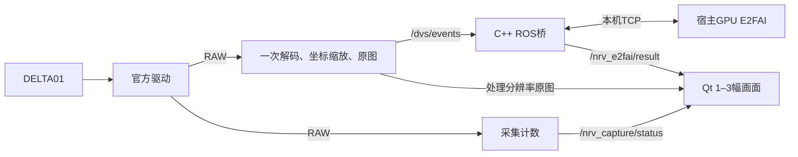

# NRV_Demo

[English](README.md) | **简体中文**

NRV DELTA01 的 E2FAI 重建与光流演示，以 `12fe7f9` 为工程基线。ROS、Qt 与事件预览运行在容器内；E2FAI 运行在宿主机 GPU 进程，通过本机 TCP 与 C++ ROS 桥通信。原 Python 质心算法和软件过滤器已移除。

## 启动

宿主机需要 Linux x86_64、Docker Engine / Compose v2、Conda、支持 CUDA 12.1 PyTorch 构建的 NVIDIA 驱动；GUI 需要 X11 或 XWayland、`DISPLAY` 和 `xhost`。先停止占用相机的其他程序。

日常使用可直接一键启动；无需进入工程目录，也无需激活 Conda 环境：

```bash
nrv-demo
```

也可以从应用菜单搜索并点击 **NRV Demo**。工程内直接启动可使用 `./start.sh`。模型环境只需首次安装一次；容器镜像不存在时，运行流程会自动构建：

```bash
./scripts/setup_e2fai.sh  # 仅首次创建宿主模型环境
./scripts/build.sh        # 修改容器内代码后主动重建
./scripts/run.sh
```

环境为 Python 3.10、PyTorch 2.1.1、NumPy 1.26.4、OpenCV 4.7.0.72。启动器默认使用 `~/miniconda3/envs/nrv-e2fai/bin/python`，可用 `E2FAI_PYTHON` 指定其他位置。配套权重放在 `checkpoints/e2fai_backbone.ckpt` 和 `checkpoints/image_residual_epoch043.pt`；安装脚本不下载权重。

## 画面与相机参数

默认显示三幅画面：**Original rendering**（解码事件原图）、**E2FAI reconstruction**（重建灰度图）、**E2FAI optical flow**（光流彩色预览）。在 **Views** 选择 1–3 幅；一幅占满，两幅并排，三幅按两列排列。隐藏画面只影响显示，不停止模型或改变输入。

图像控件不再用收到的 Pixmap 尺寸决定布局，因此异步到图不会挤动其他画面；主窗口仍可自由缩放。

**Settings** 中可选择时间窗口 **50 / 100 / 150 / 200 / 250 ms**、处理分辨率 **960×720 / 640×480 / 384×288**、增量或兼容体素模式，并可启停宿主队列的主动追赶。默认 `fixed_window` 使用固定窗口归一化、微批次异步上传和三体素池；`event_span` 保留原始整窗算法用于回退。关闭追赶后不使用800 ms新鲜度和1.5 GiB容量触发，但达到4 GiB或256批安全上限时仍删除最旧数据并继续运行，不会因此暂停或报错。编辑后点击 **Apply parameters** 生效；运行中修改任一项会自动重启采集并创建新模型会话。

**Save profile / Load profile** 保存相机参数、时间窗口、处理分辨率和画面选择。加载处理参数后仍须 Apply；画面选择立即生效。旧配置的 `filters` 被忽略，旧 `algorithm` 画面被移除；缺少新 `processing` 字段的旧配置仍可加载，并保留当前窗口和分辨率。自动保存位置为 `output/last_applied_parameters.json`。

**Stop** 停止采集及当前推理会话、清空循环状态，保留已加载权重。**Start** 创建新会话，旧结果不会进入新画面。关闭 GUI 或 Ctrl+C 后，启动器退出 GPU 进程并释放端口。

## 模型与时间尺度

默认使用 **200 ms 半开窗口 `[start, end)`、960×720 处理分辨率、全部事件和 15-bin 体素**。同一套 U-Net、ConvGRU 和两份权重支持三个分辨率；每个分辨率使用对应的光流插值网格，不缩放一个已经生成的 960×720 结果。

处理分辨率在 RAW 包首次解码时即生效：每个事件的坐标按整幅传感器视野映射，随后 `/dvs/events`、15-bin 体素、模型输出、浮点光流以及 Original rendering 都使用所选尺寸。事件数量、顺序、极性和时间戳不变，因此不会裁掉视野或抽样事件。较低分辨率会显著减少体素、神经网络、输出传输和原图缓冲区负载；相机 USB RAW 流量、首次事件解码量与事件条数不会降低。

`32FC2` 光流单位是 **所选推理网格的像素／输入窗口**；若需平均像素速度，用光流除以实际窗口秒数。彩色预览饱和尺度按 200 像素/秒自动换算，50 / 100 / 150 / 200 / 250 ms 分别为 10 / 20 / 30 / 40 / 50 像素，仅改变显示颜色，不改变浮点光流。跨窗循环状态在时间倒退、超过 **300 ms** 的真实事件断流、尺寸/连接变化或检测到批次间断时清理。

默认 `E2FAI_RESULT_MODE=thread`：CPU 结果转图与 TCP 回传由独立线程按顺序执行，可与后续推理重叠；保留有界队列和背压，不丢弃窗口。设置 `E2FAI_RESULT_MODE=inline` 可恢复串行结果处理，便于对照或撤回。

主动追赶默认开启：源回调等待严格超过 **800 ms** 时触发并清理到 **400 ms** 或以下；预计达到 **1.5 GiB（1536 MiB）或256个 ROS 事件批次**也会触发。容量清理目标为512 MiB和128批，宿主硬上限为 **4 GiB（4096 MiB）**。GUI关闭主动追赶后，800 ms和1.5 GiB触发停用，但4 GiB与256批安全清理始终保留。容器 C++ 发送队列保持32批。

解码时间保留逐事件顺序及传感器计数关系；约 4,295 秒的异常跳变在解码层修复，不用包头插值掩盖。映射事件时间计算出的年龄不等于标定后的物理端到端延迟。

## 常用命令

```bash
# 必要的短时真机检查；结束采集后 GUI 保留
DURATION=20 ./scripts/run.sh

# 无界面，仍运行模型
SHOW_GUI=false DURATION=20 ./scripts/run.sh

# 开启周期性能记录（默认关闭）
PERF_ENABLED=true DURATION=20 ./scripts/run.sh

# 无GUI启动时关闭主动追赶；4 GiB/256批安全清理仍生效
CATCHUP_ENABLED=false SHOW_GUI=false ./scripts/run.sh

# 只看官方原图，不启动宿主模型
E2FAI_ENABLED=false ./scripts/run.sh

# 只接收 RAW，不解码、推理或渲染
DECODE_EVENTS=false SHOW_GUI=false DURATION=20 ./scripts/run.sh

# 指定相机，或在无 GUI 启动时覆盖窗口与处理分辨率
CAMERA_INDEX=1 ./scripts/run.sh
WINDOW_MS=150 PROCESSING_WIDTH=640 PROCESSING_HEIGHT=480 ./scripts/run.sh

# 撤回结果线程，保留 200 ms 窗口
E2FAI_RESULT_MODE=inline ./scripts/run.sh

# 回退到原始整窗体素化；默认是 fixed_window 增量模式
E2FAI_VOXEL_MODE=event_span ./start.sh
```

## 数据链路与结果



驱动、解码器、渲染器共享 nodelet manager 进程；采集计数、C++ 桥和 GUI 各自独立。TCP 默认监听 `127.0.0.1:8765`。Qt 使用最新图像缓存，不等待推理完成。

| 话题 | 内容 |
| --- | --- |
| `/delta_driver/events` | `event_camera_msgs/EventPacket`：RAW 字节及原始元数据 |
| `/dvs/events` | `dvs_msgs/EventArray`：按顺序的 `(x, y, ts, polarity)` |
| `/delta_renderer/image` | 所选处理分辨率的解码事件原图 |
| `/nrv_e2fai/result` | 会话/窗口/来源批次元数据、`mono8` 灰度、`rgb8` 光流预览和 `32FC2` 光流 |
| `/nrv_e2fai/status` | 桥连接、暂停状态和计数 |
| `/nrv_capture/status` | RAW 包数、字节率和序号间断次数 |

运行结果在 `output/run_*/`。`summary.json` 只检查 RAW 是否接收及序号连续性；`raw_sequence_gaps` 是间断**次数**。模型和桥分别保存 `e2fai_session_*.json`、`sessions/<session>/bridge_summary.json`。`integration_summary.json` 检查 RAW、模型出图、会话错误与 ROS 批次间断；合法时间重置单独记录，不自动判失败。PASS 不代表实时性能验收。设置 `PERF_ENABLED=true` 时另写周期 `performance_*.jsonl`。GUI 显示时间测量截止 `setPixmap`，不是显示器实际呈现时刻。

当前结果见 [E2FAI 150 ms 窗口 30 秒负载测试](docs/E2FAI150ms窗口30秒负载测试.md)，并保留 [E2FAI 200 ms 窗口 30 秒负载测试](docs/E2FAI200ms窗口30秒负载测试.md)用于参考。之前的 [E2FAI 250 ms 与结果线程实测](docs/E2FAI250ms与结果线程实测.md)、[E2FAI 修复与真机短测](docs/E2FAI修复与真机短测.md)和[移植后性能测试与瓶颈分析](docs/移植后性能测试与瓶颈分析.md)保留为历史记录，其中旧窗口时长与旧桥接实现的数据不代表当前版本性能。

[examples/raw_receiver.py](examples/raw_receiver.py) 保留为独立 RAW 接收示例，不在演示链路中运行。`group_aer` 是带跨包状态的编码数据，不是完整 `.dvs` 文件；下游需保留编码、序号、时间基准、宽高等元数据。

镜像依赖 Ubuntu 20.04、ROS Noetic 与 NRV SDK/驱动。修改容器内代码后执行 `./scripts/build.sh`。USB 通过 `/dev/bus/usb` 提供，启动器临时授予容器 X11 权限并在退出时撤销。代码采用 [MIT](LICENSE)；厂商依赖和 `dvs_msgs` 按各自许可使用。
