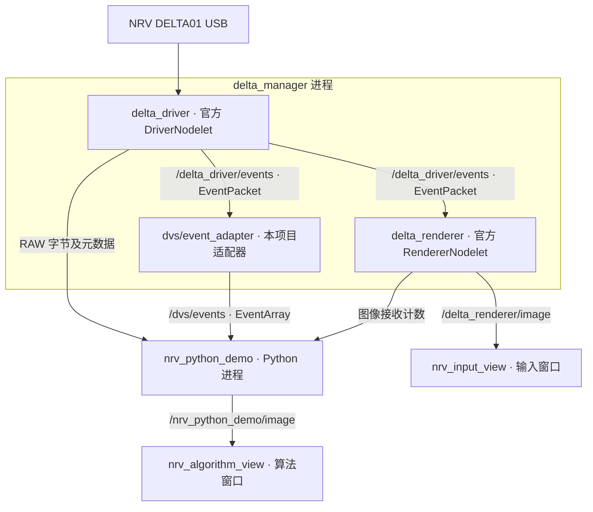

# NRV_Demo

[English](README.md) | **简体中文**

NRV DELTA01 的独立 **Docker + ROS1 Noetic + Python 3** 示例：接收 RAW 事件流，同时查看官方渲染画面和 Python 算法输出。

本仓库只包含演示必需的两个 ROS 包、容器配置和操作脚本。镜像基于公开的官方 `ros:noetic-ros-core-focal`（Ubuntu 20.04），SDK 运行库、官方驱动和解码库从 NRV 软件源安装。

## 快速开始

宿主机要求：Linux x86_64、Docker Engine、Docker Compose v2、Python 3。双窗口显示还需要 X11 或 XWayland、`DISPLAY` 和 `xhost`（Ubuntu 的 `x11-xserver-utils` 包）。ROS 和算法依赖全部在容器里。

接上 NRV DELTA01，先停止占用同一相机的 Viewer、jAER 或其他采集程序。

```bash
git clone https://github.com/lixiang-moss/NRV_Demo.git
cd NRV_Demo
./scripts/run.sh
```

第一次会自动构建镜像 `nrv-demo:noetic`。也可以先执行 `./scripts/build.sh` 单独构建。

默认打开两个 `rqt_image_view` 窗口，通过各窗口的 topic 选择框区分：

- **输入画面** `/delta_renderer/image`：官方 renderer 的事件图。
- **算法画面** `/nrv_python_demo/image`：Python 生成的事件图，带黄色活动重心十字、事件数量和坐标。

把两窗口并排放置，在镜头前移动手或物体，观察处理结果。绿色表示 ON 事件，蓝色表示 OFF 事件。算法是当前显示窗口内所有事件坐标的平均值，用于验证接入，不是目标检测；背景活动和相机自身移动也会影响重心。无事件时不绘制重心。

按 **Ctrl+C** 停止，结果保存在 `output/run_*/summary.json`，最后的算法图保存在同目录 `algorithm_last.png`。

## 常用命令

```bash
# 双画面运行 20 秒后自动退出
DURATION=20 ./scripts/run.sh

# 无桌面：保留 RAW、解码、两路图像消息，关闭查看窗口
SHOW_GUI=false DURATION=20 ./scripts/run.sh

# 只接收原始编码数据：关闭解码、算法图和官方 renderer
DECODE_EVENTS=false SHOW_GUI=false DURATION=20 ./scripts/run.sh

# 多相机时指定 SDK 序列号，或用设备下标（默认 0）
CAMERA_SERIAL=实际序列号 ./scripts/run.sh
CAMERA_INDEX=1 ./scripts/run.sh

# 修改显示目标频率（实际帧率受事件量和 Python 处理速度影响）
./scripts/run.sh image_fps:=15

# 修改源码后重新构建
./scripts/build.sh
```

## 实时 E2FAI 图像与光流

`run_e2fai.sh` 保留 Docker 中的 NRV ROS 驱动和解码器，在宿主机 GPU 上
运行模型。窗口同步显示三列：白底 events、E2FAI 加循环 image residual、
原始带 pooling 的 E2FAI flow。

需要现有的 `learning_everything` 项目、`e2fai_pp` Conda 环境、E2FAI
backbone 和 epoch-43 image-residual checkpoint；本机默认路径已经写入脚本：

```bash
./scripts/run_e2fai.sh

# 选择另一张物理 GPU，并录制显示结果
GPU=1 RECORD=true ./scripts/run_e2fai.sh

# 无窗口运行（仍保存 summary.json 和最后一帧）
HEADLESS=true DURATION=30 ./scripts/run_e2fai.sh
```

文件移动后可通过 `LEARNING_EVERYTHING_ROOT`、`PYTHON`、
`IMAGE_CHECKPOINT`、`BACKBONE_CHECKPOINT` 覆盖默认路径。结果写入
`output/e2fai_*`。默认输入为不重叠的 100 ms、15-bin、720×960 voxel；
可用 `WINDOW_MS=...` 修改时间窗。DELTA01 事件直接使用原生 960×720 分辨率，
不 crop、也不 resize；flow 单位是每个时间窗内的原生传感器像素。

当前相机适配不做相机矫正；在获得 NRV 标定和微调数据前，相对 DSEC 会存在
domain shift。

USB 通过 `/dev/bus/usb` 和 USB 设备 cgroup 规则提供给容器。脚本临时授予 root 容器 X11 访问权，退出后撤销。ROS 使用 host 网络，默认只面向本机；先停止同名的其他 ROS 演示。

## 流程和节点



`roslaunch` 在需要时自动启动 `roscore`。驱动、适配器、renderer 在同一 nodelet manager 内；Python 和两个查看器是独立进程。

| Topic | ROS 消息 | 内容 |
| --- | --- | --- |
| `/delta_driver/events` | `event_camera_msgs/EventPacket` | 官方 RAW 编码载荷、序号、编码方式、时间信息、宽高 |
| `/dvs/events` | `dvs_msgs/EventArray` | 解码后的 `(x, y, ts, polarity)` 事件数组 |
| `/dvs/camera_info` | `sensor_msgs/CameraInfo` | 相机信息；本示例未提供标定参数，重心算法无需标定 |
| `/delta_renderer/image` | `sensor_msgs/Image` | 官方渲染画面 |
| `/nrv_python_demo/image` | `sensor_msgs/Image`，`bgr8` | Python 算法画面 |

两幅画面各自累积事件，显示时间窗不严格同步。默认图像目标频率为 10 Hz；RAW 订阅不会因为显示频率而抽样。

## 对方算法如何接收 RAW

运行演示后，在仓库目录下打开另一个终端：

```bash
docker compose run --rm nrv-demo python3 /examples/raw_receiver.py
```

[examples/raw_receiver.py](examples/raw_receiver.py) 是可直接改写的最小 Python 接收节点，核心接口是：

```python
from event_camera_msgs.msg import EventPacket

def on_raw(msg):
    payload = memoryview(msg.events)
    # 在这里调用对方算法，传入 payload 和所需元数据。

subscriber = rospy.Subscriber("/delta_driver/events", EventPacket, on_raw,
                              queue_size=100, buff_size=16 * 1024 * 1024)
```

`examples/` 以只读方式挂载到容器，修改宿主机的接收脚本后重新运行即可，不用重建镜像。容器入口已经 source ROS 和工作空间；需要交互调试时执行 `docker compose run --rm nrv-demo bash`。

**RAW 的含义**：`msg.events` 是 `uint8[]`，在 rospy 接收端为字节载荷；当前驱动编码为 `group_aer`。它不是逐事件坐标数组，也不是完整 `.dvs` 文件。对方若要求 `.dvs` 文件格式，需要另行使用文件录制接口。

向下游传递时保留 `encoding`、`seq`、`time_base`、`header`、`width`、`height` 和 `is_bigendian`。`group_aer` 的解码器维护跨包状态，时间含义应按对应编码解释，不能把包头时间当成每个事件的时间。

如果对方需要的是 `(x,y,t,p)`，直接订阅 `/dvs/events`，参考 [demo.py](ros_ws/src/nrv_demo/scripts/demo.py) 的 `on_events()`。`event.ts` 为适配器映射后的 ROS 时间，`polarity=True` 表示 ON。替换 `publish_algorithm_image()` 中的处理并继续发布 `sensor_msgs/Image`，即可复用算法结果窗口。

## 检查是否跑通

终端每秒显示 RAW 包数、字节数、吞吐、序号跳变数、解码事件数和两路图像计数。

双画面模式最终 `PASS` 要求：

1. Python 收到非空 RAW 载荷。
2. 从接收到的第一个 RAW 包起，`seq` 连续。
3. Python 收到解码事件和官方 renderer 图像。
4. Python 已发布算法图像。

RAW-only 模式只检查前两项。`summary.json` 保存具体计数和各项检查；脚本按结果返回 `PASS=0`、`FAIL=1`。有时长限制时，Python 正常结束会触发 launch 整组退出，ROS 的 `REQUIRED process ... has died! / process has finished cleanly` 是这种收尾机制的提示。

该检查证明数据通路接通；包序号连续不等于相机内部无丢失，也不检查窗口可见性。Python 的逐事件对象反序列化和算法负载可能使解码支路降帧或丢包，实际算法需在目标事件率下测量。对方只需要 RAW 时，使用 RAW-only 模式。

| 现象 | 操作 |
| --- | --- |
| 没有 RAW 包 | 检查 USB 是否识别为 `04b4:00f1`，确认相机未被其他程序占用；检查序列号/下标和驱动日志 |
| RAW 有数据、解码事件少或为零 | 在镜头前制造运动，查看适配器日志和 RAW 编码方式 |
| RAW 序号跳变 | 检查驱动/接收端负载，先用 RAW-only 模式复测；避免在回调中大量打印或阻塞 I/O |
| 图像计数增长但窗口不显示 | 在桌面终端检查 `DISPLAY`、`xhost`；无桌面使用 `SHOW_GUI=false` |
| 改了包内算法却没变化 | 重启演示；ROS 包源码和 `examples/` 都从宿主机挂载 |

## 内容与依赖

```text
compose.yaml                         容器运行配置
docker/                              独立镜像和入口
scripts/build.sh, scripts/run*.sh     构建和一键运行入口
examples/*.py                         RAW 接收和 E2FAI 实时推理
ros_ws/src/nrv_demo/                  Python 示例、适配器、完整 launch
ros_ws/src/dvs_msgs/                  Event / EventArray 消息及原始许可证
output/                              本地运行结果，不进入 Git 或构建上下文
```

固定依赖：Ubuntu 20.04、ROS Noetic、`libdelta-sdk=1.2.2-1~ubuntu20.04`、`ros-noetic-delta-driver/tools=1.2.0-0focal`、`event-camera-msgs=2.0.1-0focal`、`event-camera-codecs=1.0.0-0focal`。首次构建需要能访问 Ubuntu、ROS 和 [NRV 软件源](https://nrvcorp.github.io/camera/apt/ubuntu20.04/)；仓库不包含厂商二进制或录像，也不安装厂商 Viewer。

代码从 [event-camera-lab](https://github.com/lixiang-moss/event-camera-lab) 的 NRV 示例提取。`dvs_msgs` 的两条消息来自 [rpg_dvs_ros](https://github.com/uzh-rpg/rpg_dvs_ros)，按 MIT 保留其许可证。NRV SDK/驱动/codec 按各自发行许可使用；本仓库示例代码采用 [MIT](LICENSE)。
