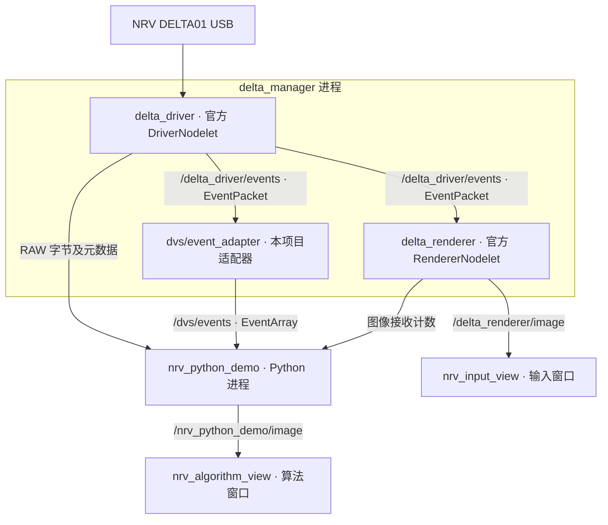

# NRV_Demo

[English](README.md) | **简体中文**

NRV DELTA01 的独立 **Docker + ROS1 Noetic + Python 3** 示例：接收 RAW 事件流，同时查看官方渲染画面和 Python 算法输出。

本仓库只包含演示必需的两个 ROS 包、容器配置和操作脚本。镜像基于公开的官方 `ros:noetic-ros-core-focal`（Ubuntu 20.04），SDK 运行库、官方驱动和解码库从 NRV 软件源安装。

## 快速开始

宿主机要求：Linux x86_64、Docker Engine、Docker Compose v2、Python 3。双窗口显示还需要 X11 或 XWayland、`DISPLAY` 和 `xhost`（Ubuntu 的 `x11-xserver-utils` 包）。ROS 和算法依赖全部在容器里。

接上 NRV DELTA01，先停止占用同一相机的 Viewer、jAER 或其他采集程序。

```bash
git clone https://github.com/lixiang-moss/NRV_Demo.git
cd NRV_Demo
./scripts/run.sh
```

第一次会自动构建镜像 `nrv-demo:noetic`。也可以先执行 `./scripts/build.sh` 单独构建。

默认打开两个 `rqt_image_view` 窗口，通过各窗口的 topic 选择框区分：

- **输入画面** `/delta_renderer/image`：官方 renderer 的事件图。
- **算法画面** `/nrv_python_demo/image`：Python 生成的事件图，带黄色活动重心十字、事件数量和坐标。

把两窗口并排放置，在镜头前移动手或物体，观察处理结果。绿色表示 ON 事件，蓝色表示 OFF 事件。算法是当前显示窗口内所有事件坐标的平均值，用于验证接入，不是目标检测；背景活动和相机自身移动也会影响重心。无事件时不绘制重心。

按 **Ctrl+C** 停止，结果保存在 `output/run_*/summary.json`，最后的算法图保存在同目录 `algorithm_last.png`。

## 常用命令

```bash
# 双画面运行 20 秒后自动退出
DURATION=20 ./scripts/run.sh

# 无桌面：保留 RAW、解码、两路图像消息，关闭查看窗口
SHOW_GUI=false DURATION=20 ./scripts/run.sh

# 只接收原始编码数据：关闭解码、算法图和官方 renderer
DECODE_EVENTS=false SHOW_GUI=false DURATION=20 ./scripts/run.sh

# 多相机时指定 SDK 序列号，或用设备下标（默认 0）
CAMERA_SERIAL=实际序列号 ./scripts/run.sh
CAMERA_INDEX=1 ./scripts/run.sh

# 修改显示目标频率（实际帧率受事件量和 Python 处理速度影响）
./scripts/run.sh image_fps:=15

# 修改源码后重新构建
./scripts/build.sh
```

## 实时 E2FAI 图像与光流

`run_e2fai.sh` 保留 Docker 中的 NRV ROS 驱动和解码器，在宿主机 GPU 上
运行模型。窗口同步显示两列：E2FAI 加循环 image residual 和原始带 pooling
的 E2FAI flow。事件预览不在实时窗口中重复渲染，以避免把完整 voxel 从 GPU
拷回 CPU。

最小模型代码已放在本项目中；checkpoint 保存在本机并由 Git 忽略。启动脚本
支持下面任意一种布局：

```text
NRV_Demo/e2fai_backbone.ckpt
NRV_Demo/epoch_043.pt
```

或者：

```text
NRV_Demo/checkpoints/e2fai_backbone.ckpt
NRV_Demo/checkpoints/image_residual_epoch043.pt
```

第一次运行先创建宿主机 GPU 环境：

```bash
cd NRV_Demo
conda env create -f environment-e2fai.yml
conda activate nrv-e2fai
```

以后更新代码和运行：

```bash
git pull
conda activate nrv-e2fai
./scripts/run_e2fai.sh

# 选择另一张物理 GPU，并录制显示结果
GPU=1 RECORD=true ./scripts/run_e2fai.sh

# 可选：相机保持 960×720，模型/image/flow 降为 640×480
RESOLUTION=640x480 ./scripts/run_e2fai.sh

# 无窗口运行（仍保存 summary.json 和最后一帧）
HEADLESS=true DURATION=30 ./scripts/run_e2fai.sh
```

可通过 `PYTHON`、`IMAGE_CHECKPOINT`、`BACKBONE_CHECKPOINT` 覆盖解释器或
权重路径。结果写入
`output/e2fai_*`。默认输入为不重叠的 100 ms、15-bin、720×960 voxel；
可用 `WINDOW_MS=...` 修改时间窗。默认 `RESOLUTION=960x720` 使用原生分辨率；
`RESOLUTION=640x480` 在构建 voxel 前将事件坐标按比例向下取整映射到低分辨率
网格，保留完整视野，同像素事件累加。相机采集与 bridge 的事件数量不会因此减少。
`SENSOR_WIDTH`/`SENSOR_HEIGHT` 仍表示真实相机尺寸，请不要用它们设置推理降采样。
推理尺寸必须不大于相机尺寸、保持相同宽高比，且宽高均为 16 的倍数。

image/flow 直接输出为选定的推理分辨率。flow 单位为每个输入时间窗内的**推理网格
像素**；640×480 下换算回 960×720 的像素位移时，水平和垂直分量均乘 `1.5`。
降采样会损失空间细节并改变事件密度，画质需结合场景检查。
summary 中 `mean_frame_processing_ms` 包含 voxel、模型、渲染以及启用的录像/GUI
调用，但不含等待和组装输入；`output_fps` 根据首末输出帧的实际间隔计算。
100 ms 固定窗口的目标输出为 10 FPS；降低分辨率主要增加处理余量，并不会自动
提高这个目标。可用 `RESOLUTION=640x480 WINDOW_MS=50 ./scripts/run_e2fai.sh`
尝试 20 FPS，但这也改变了模型输入的时间尺度。

紧凑传输优化前的 RTX A4000 实测（2026-09-11，开启 image/flow GUI、不录像，单次 20–30 秒）：

| 推理尺寸 / 时间窗 | 平均推理 | 平均每帧处理（含 GUI） | 实际输出 | bridge 缺失批次 |
| --- | ---: | ---: | ---: | ---: |
| 960×720 / 100 ms | 67.0 ms | 95.8 ms | 10.09 FPS | 0 |
| 640×480 / 100 ms | 32.0 ms | 57.8 ms | 9.14 FPS | 133 |
| 640×480 / 50 ms | 31.5 ms | 49.0 ms | 18.43 FPS | 0 |
| 640×480 / 66.667 ms | 31.1 ms | 57.9 ms | 10.41 FPS | 295 |

这些是不同实时输入、不是同一段数据的回放对比。低分辨率 100 ms 和 66.667 ms
测试中出现了持续约 35–50 MB/s 的 RAW 数据流和适配器序号缺口；原分辨率测试
大部分约为 5 MB/s。降低分辨率确实减轻了推理负担，但不保证高事件率下稳定
15/20 FPS；零 bridge 缺口也不能证明全链路无损。这些帧率不是传感器到屏幕的延迟。

实时路径由 C++ 解码器直接发送事件，宿主机独立线程持续接收，默认形成连续的
100 ms 固定窗口，以减轻接收与推理相互阻塞。高事件率下仍可能发生解码或发送
队列丢包；降低推理分辨率不降低上游数据率。`sender_dropped_batches_observed`
记录接收端观察到的 bridge 序号缺口，并不代表全链路丢包总数。NRV 的
`group_aer` 解码时间戳存在错误的长周期跳变，因此适配器按相邻 RAW 包的宿主机
到达时间为包内事件生成单调时间。若机器无法维持固定窗口速度，可用
`STRICT_WINDOWS=false ./scripts/run_e2fai.sh` 合并当前积压批次以优先保证低延迟。

### 上游传输与丢包诊断

E2FAI 启动脚本现在默认启用 `BRIDGE_COMPACT=true`。NRV2 只传每个事件的
`x/y/polarity`（5 字节，而非 NRV1 的 13 字节），包头携带起止时间和累计 RAW
缺口计数。宿主机用整数插值恢复原有的包内时间策略，保持事件次序、坐标和极性；
这并没有修复或恢复真实传感器时间戳。没有 ROS 事件订阅者时，不再构造中间
`dvs_msgs/EventArray`。固定时间窗口使用分块缓存，窗口完整后才按字节合并一次。

更新 C++ 代码后需执行 `./scripts/build.sh`。可用 `BRIDGE_COMPACT=false`
回退到 NRV1；宿主机接收器兼容两种协议。NRV2 格式为原有 20 字节 `!4sIIII`
包头（magic=`NRV2`），再接 32 字节 `!QQQQ`（起止纳秒时间、RAW 缺失包数、
RAW 乱序/重置次数），最后接 `count` 个 `<u2,<u2,u1` 事件。

`adapter_summary.json` 区分 `raw_missing_packets`（适配器订阅端缺口）、
`bridge_overflow_batches`（发送队列满）、`bridge_send_failed_batches`（发送失败）
及 `bridge_shutdown_discarded_batches`（退出时未发送）。发送队列仍有 64 包、
256 MiB 上限，处理长期跟不上时仍会丢弃旧批次，不能把它当作无损录像通道。
`e2fai_summary.json` 的 `pipeline` 合并 RAW 监视器与适配器报告；
`upstream_loss_detected=null` 表示报告不完整，不能按零丢包解释。NRV2 的上游
缺口还会触发模型循环状态重置。退出时已收到但未处理的批次单独记在
`bridge_unprocessed_batches_at_shutdown`。

推理端原有的每窗口 100 万事件抽样上限仍保留，与传输丢包是两回事；现在显式
记录 `voxel_input_events`、`voxel_kept_events`、`voxel_subsampled_windows`。
可用 `MAX_EVENTS=...` 调整上限，增大它会增加 voxel 处理开销。所有丢包计数为零
只表示这些观测点未发现缺口，不证明相机/USB 内部无损，也不代表没有推理抽样。

可重复的上游压力测试（不使用相机或模型）：

```bash
mkdir -p output
stress_dir=$(mktemp -d "${PWD}/output/stress_XXXXXX")
docker run --rm --network host -v "${PWD}:/workspace:ro" -v "${stress_dir}:/results" \
  nrv-demo:noetic python3 /workspace/tests/stress_adapter.py --protocol NRV2 --output-dir /results
```

测试独立启动 ROS master，以 100 包/秒发送每包 40 万个事件，共 500 包；将协议
改为 `NRV1` 可对照。本机同一合成输入下，NRV1 适配器订阅端缺失 8 包、平均
打包 9.61 ms/包、最大包龄 1086 ms；NRV2 完整接收 500 包共 2 亿事件、
平均打包 0.25 ms/包、最大包龄 1.20 ms。这里的包龄是发布到适配器回调的时间，
不是传感器到屏幕的延迟；这个测试也不代表 E2FAI 能处理每秒 4000 万事件。

宿主机接收、组窗、voxel、真实模型与渲染也可独立压测（无 GUI，保留推理抽样上限）：

```bash
stress_dir=$(mktemp -d "${PWD}/output/stress_host_XXXXXX")
PYTHONPATH=runtime python tests/stress_e2fai_host.py --output-dir "${stress_dir}"
```

这个测试发送每秒 2000 万个空间分布事件，共 10 秒，并要求完整接收 1000 包、
处理 100 个时间窗口、输出至少 9.5 FPS，退出时接收队列无剩余批次。
本机实测完整收到 2 亿事件、输出 10.04 FPS；其中送入 voxel 的事件按既有上限
抽样为 1 亿，不能把这个结果解释成全事件推理。最终版本的两轮 30 秒相机 GUI
测试（主要约 5 MB/s RAW）输出约 10.07–10.09 FPS，RAW/适配器/TCP 计数未观察
到丢包；持续高事件率的真实相机整链路仍需另行验证。

当前相机适配不做相机矫正；在获得 NRV 标定和微调数据前，相对 DSEC 会存在
domain shift。

USB 通过 `/dev/bus/usb` 和 USB 设备 cgroup 规则提供给容器。脚本临时授予 root 容器 X11 访问权，退出后撤销。ROS 使用 host 网络，默认只面向本机；先停止同名的其他 ROS 演示。

## 流程和节点



`roslaunch` 在需要时自动启动 `roscore`。驱动、适配器、renderer 在同一 nodelet manager 内；Python 和两个查看器是独立进程。

| Topic | ROS 消息 | 内容 |
| --- | --- | --- |
| `/delta_driver/events` | `event_camera_msgs/EventPacket` | 官方 RAW 编码载荷、序号、编码方式、时间信息、宽高 |
| `/dvs/events` | `dvs_msgs/EventArray` | 解码后的 `(x, y, ts, polarity)` 事件数组 |
| `/dvs/camera_info` | `sensor_msgs/CameraInfo` | 相机信息；本示例未提供标定参数，重心算法无需标定 |
| `/delta_renderer/image` | `sensor_msgs/Image` | 官方渲染画面 |
| `/nrv_python_demo/image` | `sensor_msgs/Image`，`bgr8` | Python 算法画面 |

两幅画面各自累积事件，显示时间窗不严格同步。默认图像目标频率为 10 Hz；RAW 订阅不会因为显示频率而抽样。

## 对方算法如何接收 RAW

运行演示后，在仓库目录下打开另一个终端：

```bash
docker compose run --rm nrv-demo python3 /examples/raw_receiver.py
```

[examples/raw_receiver.py](examples/raw_receiver.py) 是可直接改写的最小 Python 接收节点，核心接口是：

```python
from event_camera_msgs.msg import EventPacket

def on_raw(msg):
    payload = memoryview(msg.events)
    # 在这里调用对方算法，传入 payload 和所需元数据。

subscriber = rospy.Subscriber("/delta_driver/events", EventPacket, on_raw,
                              queue_size=100, buff_size=16 * 1024 * 1024)
```

`examples/` 以只读方式挂载到容器，修改宿主机的接收脚本后重新运行即可，不用重建镜像。容器入口已经 source ROS 和工作空间；需要交互调试时执行 `docker compose run --rm nrv-demo bash`。

**RAW 的含义**：`msg.events` 是 `uint8[]`，在 rospy 接收端为字节载荷；当前驱动编码为 `group_aer`。它不是逐事件坐标数组，也不是完整 `.dvs` 文件。对方若要求 `.dvs` 文件格式，需要另行使用文件录制接口。

向下游传递时保留 `encoding`、`seq`、`time_base`、`header`、`width`、`height` 和 `is_bigendian`。`group_aer` 的解码器维护跨包状态，时间含义应按对应编码解释，不能把包头时间当成每个事件的时间。

如果对方需要的是 `(x,y,t,p)`，直接订阅 `/dvs/events`，参考 [demo.py](ros_ws/src/nrv_demo/scripts/demo.py) 的 `on_events()`。`event.ts` 为适配器映射后的 ROS 时间，`polarity=True` 表示 ON。替换 `publish_algorithm_image()` 中的处理并继续发布 `sensor_msgs/Image`，即可复用算法结果窗口。

## 检查是否跑通

终端每秒显示 RAW 包数、字节数、吞吐、序号跳变数、解码事件数和两路图像计数。

双画面模式最终 `PASS` 要求：

1. Python 收到非空 RAW 载荷。
2. 从接收到的第一个 RAW 包起，`seq` 连续。
3. Python 收到解码事件和官方 renderer 图像。
4. Python 已发布算法图像。

RAW-only 模式只检查前两项。`summary.json` 保存具体计数和各项检查；脚本按结果返回 `PASS=0`、`FAIL=1`。有时长限制时，Python 正常结束会触发 launch 整组退出，ROS 的 `REQUIRED process ... has died! / process has finished cleanly` 是这种收尾机制的提示。

该检查证明数据通路接通；包序号连续不等于相机内部无丢失，也不检查窗口可见性。Python 的逐事件对象反序列化和算法负载可能使解码支路降帧或丢包，实际算法需在目标事件率下测量。对方只需要 RAW 时，使用 RAW-only 模式。

| 现象 | 操作 |
| --- | --- |
| 没有 RAW 包 | 检查 USB 是否识别为 `04b4:00f1`，确认相机未被其他程序占用；检查序列号/下标和驱动日志 |
| RAW 有数据、解码事件少或为零 | 在镜头前制造运动，查看适配器日志和 RAW 编码方式 |
| RAW 序号跳变 | 检查驱动/接收端负载，先用 RAW-only 模式复测；避免在回调中大量打印或阻塞 I/O |
| 图像计数增长但窗口不显示 | 在桌面终端检查 `DISPLAY`、`xhost`；无桌面使用 `SHOW_GUI=false` |
| 改了包内算法却没变化 | 重启演示；ROS 包源码和 `examples/` 都从宿主机挂载 |

## 内容与依赖

```text
compose.yaml                         容器运行配置
docker/                              独立镜像和入口
scripts/build.sh, scripts/run*.sh     构建和一键运行入口
examples/*.py                         RAW 接收和 E2FAI 实时推理
runtime/nrv_e2fai/                    最小独立推理模型
checkpoints/                          E2FAI backbone 和 epoch-43 image residual
environment-e2fai.yml                宿主机 GPU 推理环境
ros_ws/src/nrv_demo/                  Python 示例、适配器、完整 launch
ros_ws/src/dvs_msgs/                  Event / EventArray 消息及原始许可证
output/                              本地运行结果，不进入 Git 或构建上下文
```

固定依赖：Ubuntu 20.04、ROS Noetic、`libdelta-sdk=1.2.2-1~ubuntu20.04`、`ros-noetic-delta-driver/tools=1.2.0-0focal`、`event-camera-msgs=2.0.1-0focal`、`event-camera-codecs=1.0.0-0focal`。首次构建需要能访问 Ubuntu、ROS 和 [NRV 软件源](https://nrvcorp.github.io/camera/apt/ubuntu20.04/)；仓库不包含厂商二进制或录像，也不安装厂商 Viewer。

代码从 [event-camera-lab](https://github.com/lixiang-moss/event-camera-lab) 的 NRV 示例提取。`dvs_msgs` 的两条消息来自 [rpg_dvs_ros](https://github.com/uzh-rpg/rpg_dvs_ros)，按 MIT 保留其许可证。NRV SDK/驱动/codec 按各自发行许可使用；本仓库示例代码采用 [MIT](LICENSE)。
