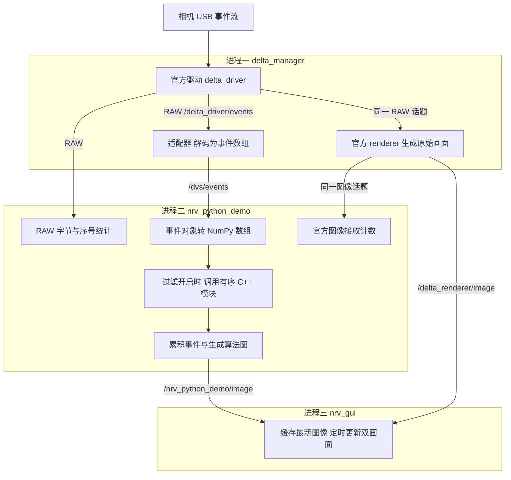

# NRV Demo 实时性能优化入门

这份教程面向使用 AI 编程的你，预计用 20–30 分钟读完。目标是让你看懂“并发、队列、延迟、瓶颈”这些词，知道画面跟不上时该查哪里，并能让 AI 用测量结果说明一次优化是否有效。

优化实时系统，先回答三个问题：**数据在哪一步花了时间？它是在计算，还是在等待？变快后，结果是否仍然正确？** 带着这三个问题读，比记住所有术语更有用。

本文对应仓库当前的事件相机、ROS1、Python 与 GUI 链路。标注为“代码事实”的内容可以在源码中核对；“待测假设”是排查方向；所有教学数字都是假设示例，不能当作本项目实测结果。

## 1 先看懂本项目的数据流

### 1.1 这里的后端在做什么

你看到的是两幅图，背后持续流动的是相机事件。一个事件记录某个像素的位置、时间和亮度变化方向；许多事件被打包、解码、过滤，再积累成画面。

这里的“后端”主要是处理这条数据流的程序。理解它暂时不需要数据库、网站接口或微服务知识。先掌握下面五个词即可。

| 概念 | 通俗理解 | 本项目的例子 |
| --- | --- | --- |
| 节点 Node | 承担某项工作的程序组件 | 接收相机、处理事件、显示画面 |
| 话题 Topic | 有名字的数据通道，发布者写入，订阅者接收 | `/dvs/events` |
| 消息 Message | 通道中传递的一份结构化数据 | 一个 RAW 包、一批事件或一幅图 |
| 回调 Callback | 数据到达后，被框架调用的处理函数 | `on_events()` 处理收到的事件批次 |
| Docker 容器 | 把依赖和运行环境放在一起 | 容器内提供 ROS、SDK、Python 和编译后的模块 |

Docker 使用宿主机的 CPU、内存和 USB。它帮助环境一致，不会自动把处理并行化，也不会自动让算法更快。节点与进程也不是一一对应：本项目有多个节点组件共用一个进程。

### 1.2 一张图看懂分工

下面画的是默认双画面模式中的主要数据流，省略了参数和相机信息等辅助通道。



用文字读这张图：RAW 同时供适配器、官方 renderer 和 Python 的 RAW 统计支路使用。适配器输出事件数组，交给 Python 过滤并生成右侧画面；官方 renderer 直接从 RAW 生成左侧画面。**官方画面没有经过 Python 降噪。** 两幅图各自累积事件，显示时间窗不严格同步。

有两个细节值得记住。第一，过滤器虽然用 C++ 写，却由 Python 进程直接调用，没有额外启动一个“C++ 过滤进程”；两个过滤器都关闭时直接全保留，不执行原生过滤循环。第二，图中的分支表示数据可以被不同组件消费，不代表已经证明这些组件正在不同 CPU 核上同时计算。

**用于判断：** 当右侧画面慢、左侧正常时，优先调查右侧独有的路径；两侧都慢时，再检查公共上游和共享资源。这只是缩小范围，共享 CPU 或队列仍可能让两条支路互相影响。

源码对照：[启动配置](../ros_ws/src/nrv_demo/launch/demo.launch)、[Python 处理入口](../ros_ws/src/nrv_demo/scripts/demo.py)、[过滤器调用方式](../ros_ws/src/nrv_demo/scripts/noise_filter.py)。

## 2 实时性能到底看什么

### 2.1 帧率高不代表反应快

想象一段延迟两秒的直播：它可以每秒流畅播放很多帧，但你看到的始终是过去。实时优化也有这个区别。

| 指标 | 它回答什么 | 在本项目中如何理解 |
| --- | --- | --- |
| 延迟 Latency | 一份数据从指定起点到终点用了多久 | 从 Python 收到事件批次，到算法图发布 |
| 吞吐量 Throughput | 每秒处理多少数据 | RAW 的 MB/s、处理事件的 events/s |
| 帧率 FPS | 每秒生成或呈现多少幅图 | 发布频率与 GUI 实际更新频率需要分别看 |
| 数据新鲜度 | 当前结果反映的是多久以前的数据 | 图像显示时，所代表的事件有多旧 |
| 抖动 Jitter | 延迟或更新间隔有多不稳定 | 平时顺畅，偶尔突然停顿 |
| P95 延迟 | 大约 95% 的测量值不超过多少 | 看多数较慢情况，避免平均值掩盖卡顿 |
| 丢失率 | 应有的数据中，有多少没有到达指定位置 | 必须先明确分母、统计位置和丢失对象 |

“延迟 20 ms”还不够完整，必须说从哪里量到哪里。处理一个回调的时间、消息等到回调开始的时间、事件发生到屏幕真正显示的时间，是不同指标。

P50 是中位数，P99 更关注少数慢请求。教学假设：100 次处理中，90 次各用 10 ms，10 次各用 200 ms，平均值为 29 ms，但 P95 是 200 ms。只报平均值，会掩盖那 10 次明显卡顿。一起看 P50、P95、P99、最大值和样本数，更容易判断是否稳定。

### 2.2 事件相机里有多种节奏

本项目同时存在事件产生、RAW 打包、事件批次处理、图像生成、GUI 更新这些节奏。它们没有一一对应关系。一包可以含很多事件，一幅图也可以累积多个包中的事件。

**代码事实：** 默认 `image_fps` 是 10，代表图像生成的目标频率；GUI 自己的定时器则每 100 ms 请求一次刷新。Python 在完成每轮工作后再 `sleep(1 / image_fps)`，所以其实际周期还包含本轮工作和调度等待，不能保证恰好 10 FPS。GUI 定时器也可能因忙碌而推迟执行。

因此，单独把 `image_fps` 改为 30，不会让当前 GUI 自动变成 30 FPS；也不能把 10 FPS 直接解释为“相机到屏幕延迟就是 100 ms”。

一个有用的近似拆解是：

```text
一条路径的端到端延迟
≈ 等待打包 + 传输与排队 + 解码与整理 + 算法计算
  + 等待生成图像 + 图像传输 + 等待 GUI 更新与显示
```

这不是把左右两条分支的所有耗时相加，而是跟踪某份数据实际经过的路径。即使算法本身很快，等待也可能占大部分时间。

### 2.3 当前 PASS 只检查通路

完整模式的 `PASS` 检查 Python 是否收到非空 RAW、收到的 RAW 序号是否连续、是否收到解码事件和官方图像，以及是否发布过算法图。RAW-only 只检查 RAW 接收与序号连续。

它不检查延迟、稳定帧率、窗口是否真的可见，也不证明相机内部完全没有丢失。`raw_sequence_gaps` 记录的是**序号不连续的发生次数**，一次跳过多个包仍只增加一次；序号重置也可能造成不连续。这个数字不能直接当作丢包数或丢失率。

**用于判断：** 先用 `PASS` 确认数据能走通，再用明确起终点的延迟、稳定吞吐量和正确性检查判断是否足够实时。

源码对照：[默认频率配置](../ros_ws/src/nrv_demo/launch/demo.launch)、[发布循环与 PASS 条件](../ros_ws/src/nrv_demo/scripts/demo.py)、[GUI 定时刷新](../ros_ws/src/nrv_demo/scripts/gui.py)。

## 3 串行 并发 并行与异步

### 3.1 四个词描述了不同事情

用做饭作类比：切菜后才能炒菜，这是先后依赖；煮饭时去洗菜，是让多件事在同一段时间内推进；两个人同时切不同的菜，是同时工作；电饭锅启动后通过提示音告诉你完成，是一种异步协作方式。

| 概念 | 关键含义 | 常见误解 |
| --- | --- | --- |
| 串行 Serial | A 完成后才做 B | 串行都应消除；其实数据依赖可能要求顺序 |
| 并发 Concurrency | 多件任务在重叠的时间段内推进 | 有并发就一定用了多个 CPU 核 |
| 并行 Parallelism | 多件任务在同一时刻实际执行 | 开了多个线程就必然并行且更快 |
| 异步 Asynchronous | 发起工作与取得结果不必在一次等待中完成 | 改成 `async` 就能加速重计算 |

并发可以靠单核轮流切换实现。异步描述协作方式，通常需要队列、回调或任务调度配合，本身不会增加算力。相应地，同步调用通常要等当前操作返回，再执行后续代码；阻塞则强调线程在等待期间不能继续自己的后续工作。等待锁、磁盘或网络都可能造成阻塞。

下面只表示关系，方块宽度不代表项目实测时间：

```text
时间向右 →

串行          [AAAA][BBBB]
单核交错并发  [AA][BB][AA][BB]
双核并行 核1 [AAAA]
         核2 [BBBB]
异步协作      [发起A][做B或让出执行权][A完成后处理结果]
```

### 3.2 流水线能提高吞吐量 但未必缩短每份数据的耗时

教学假设：每包数据需要解码 4 ms、处理 6 ms、输出 2 ms，阶段耗时固定，使用独立资源，忽略通信开销，允许阶段之间等待。

串行处理时，一包需要 12 ms，做完才开始下一包。流水线可以让不同包占据不同阶段：

```text
包 A  解码 0–4 ms    处理 4–10 ms    输出 10–12 ms
包 B  解码 4–8 ms    处理 10–16 ms   输出 16–18 ms
包 C  解码 8–12 ms   处理 16–22 ms   输出 22–24 ms
```

进入稳定阶段后，大约每 6 ms 可以产出一包，因为处理阶段最慢；但第一包仍花了 12 ms，后面的包还可能排队。真实程序若共用一个 CPU 核，或搬运数据代价很大，也未必达到这个吞吐量。

**用于判断：** AI 提议做流水线时，要求它分别说明“每秒多处理了多少”和“每份结果是否更快到达”，不能只报告其中一个。

### 3.3 进程 线程与锁

进程可以理解为拥有独立工作空间的一组工作人员。线程是同一工作空间内的不同执行路线，能方便地访问同一份数据，但也容易发生冲突。多进程隔离较强，互相传数据通常需要通信或专门的共享内存安排。

锁像共享白板旁的一把钥匙：修改白板前先拿钥匙，其他人等你写完。它保护的是“这一组读写需要作为一个整体完成”。如果两条执行路线同时更新计数或清空画布，就可能读到不一致的状态，这叫竞态条件。

**代码事实：** `demo.py` 的事件回调会在锁内更新画布和统计；生成图像时，会在同一把锁内复制并清空画布。二者碰上时有一方需要等待。过滤计算位于这段锁之外，不能把整个回调的耗时都归因于锁。

缩短锁内工作可能有帮助，但直接删锁可能造成事件消失、重复或统计不一致。优化复制时也要解释数据的“所有权”：旧画布交给谁读，何时允许另一方覆盖它。

### 3.4 Python GIL 需要理解到哪一层

本项目的容器使用 Ubuntu 20.04 和 ROS Noetic 的 Python 3 环境，下面按其常规 CPython 3.8 说明。GIL 是解释器内部的锁，使同一个解释器中通常只有一个线程在某一时刻执行 Python 代码。因此，把大量纯 Python 循环拆给更多线程，通常不能直接获得多核计算加速；等待 I/O 的工作仍可能从线程并发中受益。[Python 3.8 线程文档](https://docs.python.org/3.8/library/threading.html)

本项目有一个重要例外：过滤通过 `ctypes.CDLL` 调用原生 C++ 函数。此类调用会在执行外部函数时释放 GIL，结束后再获取它。但原生函数内部仍是按事件顺序执行的循环，释放 GIL 不会把这个循环自动分成多核任务。[Python 3.8 ctypes 文档源码](https://github.com/python/cpython/blob/v3.8.20/Doc/library/ctypes.rst)

GIL 也不替代业务锁。你仍需要保护画布、计数和过滤历史。遇到“Python 慢”的结论时，应继续追问：慢在 Python 对象整理、原生算法、等待锁，还是消息传输？这些原因对应不同改法。

### 3.5 本项目哪些顺序不能随便改

邻域过滤会记住之前哪些像素出现过事件。教学示例：A 是一个孤立事件，被丢弃，但它的出现仍被写入历史；1 ms 后相邻像素来了 B，在 5 ms 窗口内，B 可以得到 A 的支持而被保留。

如果让 A、B 随意并行，B 可能在 A 写入历史前完成判断，结果就变了。同像素间隔过滤还依赖上次**保留**事件的时间。这些历史会跨 ROS 消息批次保留，不能认为“换了一包就互不相关”。RAW 的 `group_aer` 解码也有跨包状态。

**用于判断：** 要求 AI 先画出数据依赖，再决定在哪里并发。处理链可以让不同阶段协作，但事件历史、时间顺序以及共享内存必须保持正确。

源码对照：[锁与画布操作](../ros_ws/src/nrv_demo/scripts/demo.py)、[顺序过滤循环](../ros_ws/src/nrv_demo/src/noise_filter.cpp)、[跨包与重置测试](../tests/test_noise_filter.py)、[RAW 编码说明](../README.zh-CN.md)。

## 4 队列与批处理为什么影响延迟

### 4.1 队列能容纳等待 不能消除工作

队列就是等候区。教学假设：每 10 ms 来一包，即每秒 100 包；处理一包固定花 15 ms，单个处理者每秒只能处理约 66.7 包。忽略启动差异，且队列暂时未满：

| 持续时间 | 累计到达 | 累计处理能力 | 积压约为 |
| --- | --- | --- | --- |
| 1 秒 | 100 包 | 67 包 | 33 包 |
| 2 秒 | 200 包 | 133 包 | 67 包 |
| 3 秒 | 300 包 | 200 包 | 100 包 |

```text
输入 100 包/秒 → [旧包 旧包 旧包 …… 新包] → 处理约 67 包/秒
                      等候区越来越长
```

前面若已有 100 包，按每包 15 ms，新包仅等待前面的处理就可能花约 1.5 秒。把队列容量从 100 改为 1000，只是允许存下更多旧数据，处理能力仍然不够。

实际队列有限，满后可能丢弃、阻塞或把压力传到别处，取决于组件实现。遇到突发负载，小队列可吸收短暂波峰；长期输入超过处理能力时，必须提高处理能力、合理减少工作量，或采取符合业务要求的丢弃策略。

即使平均处理能力勉强高于平均输入，也要给突发事件留余量。事件相机的负载会随运动、光照和噪声变化，不能只用静止场景证明性能稳定。

### 4.2 队列大小和字节缓冲不是同一个参数

**代码事实：** Python 的 RAW 订阅设置 `queue_size=100`、`buff_size=16 MiB`；解码事件订阅为 `queue_size=10`、`buff_size=64 MiB`。图像订阅通常使用 `queue_size=1`。

`queue_size` 与消息数量有关，`buff_size` 是接收字节缓冲设置。尤其在 rospy 中，消息还要经过字节接收与反序列化，不能把一个参数理解为整条链路唯一的队列上限。`queue_size=1` 也不保证“永远没有旧数据”，更不能把队列 100 换算成固定延迟 1 秒。[ROS Noetic Subscriber 参数说明源码](https://github.com/ros/ros_comm/blob/noetic-devel/clients/rospy/src/rospy/topics.py)

**用于判断：** 除了配置容量，还要知道实际积压发生在哪一层，消息进入业务回调时已经有多旧。容量和当前占用量是两回事。

### 4.3 批处理用等待换取效率

一次寄十份材料，比寄十次各一份更容易摊薄固定手续。程序的批处理也一样：更大的事件包可能减少回调次数和固定调用开销，但较早到达的事件要等其他事件凑成批。

**代码事实：** 驱动配置了 10 ms 的打包时间阈值、1 MiB 的大小阈值和 200 的最大排队消息数。适配器会解完整个 RAW 包后再发布事件数组。这些是配置与代码行为；厂商驱动具体如何触发阈值，需要查其实现或测量，不能把 10 ms 当作已测端到端延迟。

更小批次可能减少等待，却增加调用与传输开销；更大批次可能提高吞吐，却让结果更晚到达。因此调批次要同时看延迟分布、吞吐量和 CPU，而不是只看每秒包数。

### 4.4 显示可以跳过旧图 算法输入要看语义

**代码事实：** GUI 收到图像后，用 `frames[key] = message` 覆盖同一路旧图，刷新时再取走最新缓存。若两次刷新之间来了多幅图，中间图像可能不会显示。这是把有限显示机会留给较新结果的一种方式，但它不能消除上游早已产生的积压。

这一思路不应直接照搬到 RAW 或过滤输入。少画一张旧图，与少处理一批事件，会产生不同后果：后者可能破坏解码状态、邻域支持和时间历史。

背压是让下游通过某种机制把“处理不过来”的信息传给上游，从而限制或调整输入。传感器未必支持按软件需要暂停，某个订阅端阻塞也可能只让其他缓冲区堆积。采用背压前，要确认信号能传到哪一层、那一层是否有能力响应。

源码对照：[订阅与缓冲配置](../ros_ws/src/nrv_demo/scripts/demo.py)、[驱动参数](../ros_ws/src/nrv_demo/launch/demo.launch)、[按包解码发布](../ros_ws/src/nrv_demo/src/dvs_adapter_nodelet.cpp)、[GUI 最新图像缓存](../ros_ws/src/nrv_demo/scripts/gui.py)。

## 5 性能瓶颈通常藏在哪里

### 5.1 先区分忙着算与忙着等

瓶颈是当前限制你所关心指标的环节。对吞吐量来说，它可能是处理能力最低的阶段；对延迟来说，它也可能是占据大量等待时间的队列或刷新周期。瓶颈还会随输入负载改变。

CPU 密集表示主要时间用于计算，例如解码、逐事件遍历；I/O 密集表示主要受数据输入输出影响，例如等待 USB、网络或磁盘。还有一些等待来自锁和调度，不属于算法计算，也不等同于 I/O。

| 现象 | 值得调查的方向 | 不能直接下的结论 |
| --- | --- | --- |
| 某一个 CPU 核长期很忙 | 串行热点、Python 对象处理、解码 | 整台机器 CPU 平均不高，所以算力充足 |
| CPU 不高，结果却很旧 | 排队、定时等待、阻塞、上游供给 | 一定需要更强的 CPU |
| 高事件率时突然卡顿 | 批次变大、处理超时、内存分配、积压 | 平时能跑，所以只需扩大队列 |
| 图像发布正常，窗口更新慢 | GUI 转换、缩放、刷新节奏 | 算法没有正确发布 |

假设一台机器有 8 个同等计算能力的核，其中一个核满载，其余空闲，按整机归一化的 CPU 占用可能只有约 12.5%。不同工具的百分比口径不同，观察时要同时看进程、线程和每核负载。

### 5.2 搬运数据也是工作

你可以把序列化理解为把数据打包成适合传输的字节，把反序列化理解为在接收端重新拆出结构。即使业务计算只有几行，打包、拆包、申请内存和复制数据也可能很费时。

**代码事实：** 适配器逐事件填写 ROS 字段，跨进程传给 Python；`on_events()` 再分别提取 x、y、极性和时间，构造四个 NumPy 数组。这四次 `np.fromiter()` 仍使用 Python 生成器访问事件对象。随后按保留掩码筛选数组，也会产生新的数组。

NumPy 擅长在数组上批量运算，通常称为向量化；但把大量对象整理成数组的入口成本并没有消失。因此，“已经用了 NumPy”或“核心算法已经是 C++”都不能证明整条链路没有 Python 热点。

图像路径也会搬运数据：算法图使用 `canvas.copy()`、`frame.tobytes()`，GUI 创建并复制图像，再进行颜色转换和缩放。这些操作是否值得优化，取决于它们的实际耗时、图像尺寸和执行频率。

“零复制”表示某个边界避免了复制，必须说清是哪一段。本项目的 nodelet 共用进程，但 Python 和 GUI 是独立进程；不能把“使用了 nodelet”描述为全流程零复制。

### 5.3 锁与显示也可能成为限制

长时间持锁会让其他执行路线等待。不过，锁的等待时间和锁内执行时间是两个指标：锁内工作很短，也可能遇上频繁竞争；某次回调很慢，也可能根本没有等锁。

显示处理还可能包含你不易注意到的成本，例如绘制文字、转换颜色、平滑缩放图片。对于本项目，降低图像生成频率有机会减少绘图和复制开销，但也会增加等待下一幅图的时间，并改变每幅算法图累积事件的窗口。调频率后，质心对应的时间范围可能不同。

记录日志和保存文件也可能影响实时性，但要核对实际执行位置。当前最终 PNG 和 `summary.json` 在采集结束时保存，不能说它们在每个事件回调中持续拖慢处理。Python 主循环倒是会查询 ROS 参数，这也可以在分段测量中单独计时。

### 5.4 局部快十倍 整体可能只快一点

教学假设：一条串行路径共用 10 ms，其中过滤 2 ms，其他部分 8 ms。把过滤加速十倍后，总时间变成 `8 + 0.2 = 8.2 ms`，整体只加速约 1.22 倍。即便过滤耗时降到零，总时间也仍有 8 ms，最多加速 1.25 倍。这是 Amdahl 定律的直观含义：未被优化的部分限制总收益。

上述算式假设其他成本不变。真实系统还有队列：如果一个小改动让处理能力跨过输入速率，积压可能明显减少；如果仍然处理不过来，局部加速也未必解决长期滞后。

**用于判断：** 让 AI 先报告热点占比，再估计整体收益。当前 C++ 模块已有 `-O3`，Docker 也使用 Release 构建；“改成 Release”并不是尚未做过的优化。若未来引入 GPU，同样要计算数据传输、批量等待和计算的总成本，不能仅凭设备名称判断会更快。

源码对照：[对象转换与图像生成](../ros_ws/src/nrv_demo/scripts/demo.py)、[GUI 图像处理](../ros_ws/src/nrv_demo/scripts/gui.py)、[编译选项](../ros_ws/src/nrv_demo/CMakeLists.txt)、[容器构建方式](../docker/Dockerfile)。

## 6 如何一步步定位瓶颈

### 6.1 第一步 把感觉改写成可测目标

“优化一下实时性”太宽泛。更清楚的目标可以是：在相同场景和输入事件负载下，降低事件批次进入 Python 后到对应算法图发布的 P95 延迟，保持过滤规则不变，并检查 RAW 序号间断、积压和内存变化。

如果问题是“手动了，屏幕很晚才动”，就需要覆盖 GUI 的新鲜度或更完整的端到端测量。只优化 Python 回调耗时，可能没有回答这个问题。想做到多低的延迟，应由用途决定；本项目现有代码没有给出已经验收的实时指标。

### 6.2 第二步 建立能比较的基线

基线就是改动前的测量结果。记录代码版本、相机设置、软件过滤设置、输入事件率、运行模式和测量时段；区分启动过程与稳定运行。事件率相同但空间分布不同，过滤成本也可能不同。

下面三种命令均在仓库根目录执行。30 秒是示例采集时长，不代表足以完成性能验收。第一次启动可能先构建镜像，不能把构建时间算进处理性能。

```bash
cd /home/woss/Documents/ChatGPT/NRV_DEMO

# A 仅接收 RAW  关闭适配器 官方 renderer 和算法图
DECODE_EVENTS=false SHOW_GUI=false DURATION=30 ./scripts/run.sh

# B 完整处理但不打开窗口  两路图像仍然生成和发布
DECODE_EVENTS=true SHOW_GUI=false DURATION=30 ./scripts/run.sh

# C 正常双画面模式
DECODE_EVENTS=true SHOW_GUI=true DURATION=30 ./scripts/run.sh
```

每次运行结束后再启动下一种模式。模式 C 到时会停止采集但保留 GUI；关闭窗口后外层脚本才完整退出。`output/run_*/summary.json` 保存该次统计，在同一窗口重新开始采集会覆盖这一运行目录中的结果。

| 对照 | 可以缩小什么范围 | 仍不能证明什么 |
| --- | --- | --- |
| A 正常，B 明显变差 | 新增解码、事件处理、图像生成等路径的负载值得查 | 不能直接断定是过滤算法 |
| B 正常，C 明显变差 | GUI 与新增图像订阅、传输、显示相关成本值得查 | 不能只归因于绘图函数 |
| A 也有序号间断 | 应检查公共上游、RAW 接收及系统负载 | 不能仅凭该计数定位到 USB 或相机内部 |

**比较前先统一实际参数。** GUI 会从 `output/last_applied_parameters.json` 恢复 ON/OFF 和过滤设置，并生成相机设置文件；无界面模式不会自动恢复这份 JSON。如果 ROS master 仍在运行，`/nrv_noise` 还可能保留先前的值。应让 AI 核对两种模式实际生效的相机设置和 `/nrv_noise`，先统一，再测量。三个默认命令本身不是严格的单变量实验。

模式选择使用上面的 `SHOW_GUI`、`DECODE_EVENTS` 环境变量。不要用追加 `show_gui:=false` 来代替 `SHOW_GUI=false`：运行脚本在解析这些额外 launch 参数之前，就已经选择了启动哪个 launch 文件。

对真人运动的场景，可尽量固定运动方式和光照，每组重复至少三次，记录输入事件率范围；这只能改善可比性，不能变成完全相同的输入。如果以后需要严格比较，应准备可重复的数据源并先验证回放链路，本项目目前没有提供现成的基准回放流程。

### 6.3 第三步 看清已有指标的含义

| 当前可见内容 | 真实口径 | 不能替代的指标 |
| --- | --- | --- |
| RAW 包数、字节数、MB/s | Python RAW 支路收到的数据 | 相机内部事件总量与全链路无丢失证明 |
| `raw_sequence_gaps` | Python RAW 支路序号不连续的次数 | 缺失包总数或其他支路的丢失率 |
| `decoded_events`、events/s | Python 处理到的输入事件数量及速率 | 相机生成率、适配器全部输出率 |
| `filtered_events`、Retained | 保留事件数量、本次采集累计保留比例 | 传输丢包率或过滤准确率 |
| `rendered_images` | Python 收到的官方图像数量 | GUI 真正显示的图像数 |
| `algorithm_images` | 算法图发布调用后的计数 | 下游收到或屏幕呈现的帧数 |

`decoded_events` 在过滤返回后才累加，但累计的是过滤前的输入事件数。软件过滤丢掉不满足规则的事件属于算法选择，和传输中意外丢失数据应分开统计。

现有 `summary.json` 没有处理耗时分位数、队列等待、图像年龄或 GUI 呈现计数。`events_per_second` 写入状态消息的临时副本，日志也显示速率，但这个瞬时速率字段没有写进最终 summary。适配器自己的序号间断日志也没有合并进 Python summary。

### 6.4 第四步 分段计时

让 AI 添加测量时，可以指定下面这些边界。它们是建议新增的观测点，并非当前已经具备的指标。

```text
适配器收到 RAW → 解码和整理完成 → 发布事件数组
Python 回调开始 → 对象转数组完成 → 过滤完成 → 掩码筛选完成
               → 开始取画布锁 → 取得画布锁 → 更新画布完成
图像生成开始 → 复制与绘制完成 → 发布调用返回
GUI 收图回调 → GUI 刷新取到图像 → 图像提交给控件
```

每批同时记录事件数和阶段耗时，按固定时间窗口汇总 P50、P95、P99、最大值与样本数。比较时还要考虑批次大小：更大的一包耗时更长，不一定代表每事件处理效率下降。

同进程短耗时可用 `time.perf_counter()` 的前后差值；它包含执行期间的等待，因此“耗时长”仍需结合 CPU 采样区分计算与等待。`time.monotonic()` 适合测不受系统时间调整影响的间隔。两者的数值都不能直接与 ROS 时间戳相减。[Python 3.8 time 文档源码](https://github.com/python/cpython/blob/v3.8.20/Doc/library/time.rst)

还有三条测量边界容易遗漏：

1. 只在 `on_events()` 内计时，看不到回调开始前的传输、反序列化和等待。要覆盖这些成本，需要上游观测点与可关联的消息标识，或进一步分析 ROS 接收阶段。
2. `publish()` 返回不代表 GUI 已收到，`setPixmap()` 返回也不证明显示器已经完成呈现。应按真实测量终点命名指标。
3. 不要在每个事件上打印日志；先做每批或抽样计时，再周期汇总，并比较开关测量时的开销。

### 6.5 第五步 验证时钟与数据对应关系

本项目把首个传感器事件时间锚定到 RAW 包头的 ROS 时间；包头为零时改用当时的 ROS 时间。事件数组的 header 使用该批最后一个事件的映射时间，算法图继续沿用最新处理批次的 header。

因此，图像 header **不是图像生成时间**，更不是 GUI 显示时间。即使该批最后一个事件被过滤，header 仍可能是它的时间；后续没有新事件时，图像也可能继续沿用旧时间戳。

直接计算“现在减 header”之前，要确认驱动包头定义、时钟来源和映射误差，并决定图像用最早事件还是最新事件代表时间。未经验证只能将其视为某种消息年龄估计，不能声称精确测得了物理事件到屏幕的延迟。

### 6.6 第六步 一次改一个因素并检查结果

先根据测量选择一个改动，再在同样条件下复测。验收至少同时回答：目标延迟是否改善，吞吐是否跟得上，积压与内存是否稳定，正确性有没有改变。

例如修改过滤实现，要比较相同事件序列得到的保留掩码，并覆盖跨包邻居、同像素重复事件、时间重启和边界像素。修改显示策略，则要确认事件输入仍被正确处理，图像新鲜度确实提高。现有[过滤测试](../tests/test_noise_filter.py)提供了这些规则的起点，但并不能替代高负载下的性能测量。

源码对照：[运行脚本](../scripts/run.sh)、[GUI 参数恢复与启动](../ros_ws/src/nrv_demo/scripts/gui.py)、[统计与输出](../ros_ws/src/nrv_demo/scripts/demo.py)、[时间戳映射](../ros_ws/src/nrv_demo/src/dvs_adapter_nodelet.cpp)。

## 7 本项目值得优先验证的方向

下面是有源码依据的排查入口，**不是已经确认的瓶颈排名**。先看自己遇到了哪种现象，再补相应测量；如果测量不支持，就换方向。

| 出现这种现象时 | 待验证原因 | 测什么 | 有证据后考虑的改法 | 正确性约束 |
| --- | --- | --- | --- | --- |
| 提高 `image_fps`，可见更新仍没有增加 | GUI 固定刷新周期或显示成本限制 | 生成、接收、刷新间隔与图像年龄 | 协调生成和显示频率，减少无用刷新 | 重新检查累积窗口及 CPU 成本 |
| 事件很多时 Python 忙，原生过滤耗时占比低 | 逐事件对象访问与数组构造较贵 | 回调前接收成本、四个数组构造耗时 | 减少重复遍历和格式转换，评估更紧凑的接口 | 坐标、时间、极性和顺序保持一致 |
| 画面持续更新但越来越旧 | 输入超过处理能力，某层积压 | 消息年龄趋势、输入输出速率、可观测队列占用 | 提高热点处理能力，给队列设合理边界 | 不得随意丢弃有状态 RAW 或过滤输入 |
| 回调与图像生成周期性互相等待 | 画布锁竞争或复制成本 | 等锁时间、持锁时间、复制耗时 | 缩短临界区，评估交换前后台画布 | 明确内存所有权，不能重复或遗漏事件 |
| 开启过滤后高负载明显变慢 | 顺序邻域检查成为计算热点 | 按事件数、场景和配置分组测过滤耗时 | 优化顺序实现的数据访问与重复工作 | 保持跨批历史和保留规则，不直接逐事件并行 |

判断积压前，要先确认仍有新事件持续输入。静止场景可能没有新事件，图像沿用旧时间戳；这种情况下，不能单凭图像年龄增长就断定有排队。

交换前后台画布，也叫双缓冲：一份接收新事件，一份用于生成图像，合适时交换角色。它有机会减少锁内复制，但只有在旧画布读完后才允许覆盖。它是一种待评估的设计，不是删掉 `copy()` 就自动成立。

改变过滤参数或通过相机设置减少输入事件，也可能让输出“看起来更快”，但这会改变处理的数据。尤其软件过滤发生在 RAW 接收、解码和数组整理之后，少保留事件不代表这些上游成本一起下降。应区分“相同任务执行得更快”和“改变了输入或输出要求”。

如果热点最终位于 ROS 对象传输，采用更紧凑的消息或将部分处理前移到 C++ 才可能有意义；那会涉及接口兼容和额外维护成本。先拿到证据，再决定是否值得做结构调整。

## 8 如何让 AI 帮你优化

你不必指定线程池、共享内存或某种新框架。更有效的要求是：说明现状、给出证据、保持规则、报告前后对照。下面四组提示词可直接复制，再补充自己的现象和测量目标。

### 8.1 让 AI 先梳理链路

```text
请只读分析本项目实时数据链路，从相机 RAW 到算法图和 GUI。
画出进程边界、话题、回调、队列和生成/显示节奏，标注源码位置。
说明哪些阶段有先后依赖，哪些只是可能并发，哪些共享状态需要保护。
区分代码事实、外部依赖中未确认的行为、需要测量的性能假设。
先给我看得懂的链路和测量建议，不要仅凭静态代码宣布瓶颈。
```

### 8.2 让 AI 添加性能测量

```text
请为本项目加入开销可控、可以关闭的性能测量。
先定义每个指标的起点、终点、时钟和统计口径，再实施。
覆盖对象转数组、过滤、等待画布锁、图像生成与发布、GUI 接收与刷新。
回调外的反序列化、传输和排队如果无法测到，要明确列出盲区。
按批次记录事件数和耗时，周期汇总 P50/P95/P99、最大值与样本数。
不要逐事件打印，不改变过滤规则、消息顺序或既有统计字段的含义。
检查测量开关的额外开销，不把消息年龄冒充已校准的物理端到端延迟。
```

### 8.3 让 AI 根据数据定位瓶颈

```text
请结合本项目代码和我提供的测量结果分析性能问题。
先核对不同运行是否使用相同相机参数、过滤参数、输入负载和统计时段。
区分计算耗时、数据转换、等待锁、队列积压与显示等待，检查缺失的证据。
按证据强弱排列候选原因，每个原因给出一个能验证或推翻它的对照实验。
同时看延迟分布、吞吐、数据新鲜度、序号间断与内存趋势。
如果还不足以定位，请说清下一步最值得补的测量，不要默认增加线程或队列。
```

### 8.4 让 AI 实施并验收一次优化

```text
请根据已经测出的主要瓶颈，实施一个改动范围尽量小的优化。
先说明预计改善哪个指标、依据是什么、可能付出什么代价。
保留事件顺序、跨批过滤历史、时间戳语义和现有接口行为。
若确实必须改变其中一项，先明确说明改变后的行为和兼容方案。
优先用相同可回放输入和配置比较改动前后。
暂不能回放时，固定场景与配置、重复测量并报告事件率差异和可比性限制。
提供延迟分位数、吞吐与资源使用结果。
检查保留掩码等正确性结果、长时间积压和高事件率场景。
区分静态检查、合成数据测试和真实相机测量；没测到的不要写成已验证。
给出撤回这项改动的方法，并说明它解决了什么、还剩什么限制。
```

### 8.5 一页速查

| 遇到这个词 | 先这样理解 | 你可以追问 AI |
| --- | --- | --- |
| 串行 | 有先后顺序 | 顺序来自业务依赖，还是实现方式？ |
| 并发与并行 | 多任务推进与同一时刻执行 | 哪些资源真正能同时工作？ |
| 异步与阻塞 | 结果稍后处理与执行路线等待 | 等待的是什么，谁来继续处理结果？ |
| 进程与线程 | 独立工作空间与共享空间中的执行路线 | 数据怎样传递，共享什么？ |
| 锁与竞态 | 保护成组读写与无保护的执行冲突 | 等锁多久，删锁会改变什么？ |
| 延迟与新鲜度 | 从起点到终点的时间与数据有多旧 | 起终点和时间戳分别是什么？ |
| 吞吐与 FPS | 数据处理速率与图像生成/呈现速率 | 到底统计在哪一层？ |
| P95 与抖动 | 较慢情况与稳定性 | 样本多少，P99 和最大值怎样？ |
| 队列与背压 | 暂存等待与向上游反馈压力 | 积压在哪，满了如何处理？ |
| 批处理 | 用一批工作摊薄固定成本 | 节省开销的同时增加多少等待？ |
| 序列化与复制 | 打包传输与搬运内存 | 比算法计算贵多少？ |
| 向量化与原生代码 | 批量数组计算与编译后的计算 | 输入整理成本是否也减少？ |

记住几个常见误区，读优化方案时就能迅速检查：

- **线程越多越快：** 先看任务独立性、GIL、锁、调度和数据搬运成本。
- **队列越大越实时：** 队列容纳的是等待，处理能力不足时更容易留下旧数据。
- **FPS 高就延迟低：** 稳定更新旧画面仍然是滞后，必须看数据年龄。
- **CPU 总占用低就没有计算瓶颈：** 单核可能已经饱和，其他时间也可能在等待。
- **过滤掉的多就是丢包多：** 软件保留规则与传输完整性是两种统计。
- **PASS 或一次短测就证明优化成功：** 通路、算法正确性、稳定性能需要各自的证据。
